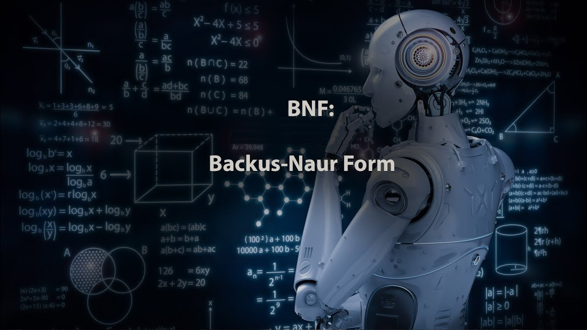

# Descrição de linguagens (BNF e eBNF)



Antes de executar os testes deve instalar o módulo `bnf`:
```
python3 -m pip install bnf
```
Para testar as suas resoluções dos exercícios deve criar um ficheiro
com o nome do exercício, por exemplo `ex01.bnf`, e executar `python
test_ex01.py` (ou apenas `./test_ex01.py` em *UNIX*) para executar
os testes desse exercício.
Para testar todos os exercícios pode fazer `python -m unittest`;
os testes aos exercícios ainda não resolvidos são ignorados (*skipped*) [**s**].
Opções com `python -m unittest -h`.

O analisador de teste utilizado, **bnf**, é um *parser LL greedy* pelo que não são permitidas regras:
1. com recursão à esquerda: `<x> ::= <x> ...`
2. que requerem *backtracking*: `<x> ::= a* a ...`
3. mais curtas primeiro: `<x> ::= a | a b` (deve fazer `<x> ::= a b | a`)
4. carateres terminais especiais <>()|+\*:= devem ser precedidos de \\

O analisador pode ser invocado em modo *debug* com:
```
echo -n "input" | DEBUG=1 python3 -m bnf gram.bnf
```
A diretoria `ebnf` contém os testes para a variante de *extended BNF*
disponível no módulo **ebnf**.

## ex01
Considere a seguinte gramática em notação BNF, cujo símbolo inicial é
`palavra`:
```
<palavra> ::= <sílaba> <sílaba>
<sílaba> ::= <vogal> <consoante> | <consoante> <vogal>
<vogal> ::= a | e | i | o | u
<consoante> ::= b | c | d | f | g | h | j | l | m | n | p | q | r | s | t | v | x | z
```
- (a) Indique os símbolos terminais e os símbolos não terminais da gramática.
- (b) Indique, justificando, quais das expressões seguintes pertencem ou
não pertencem ao conjunto de palavras da linguagem definida pela gramática:
	- asno
	- cria
	- gato
	- leao
	- OVOS
	- tu
	- vaca

## ex02
Considere a seguinte gramática em notação BNF, cujo símbolo inicial é
`S`:
```
<S> ::= <A> <B>
<A> ::= <x> <A> | <x>
<B> ::= <y> <B> | <y>
<x> ::= A | B | C | D
<y> ::= 1 | 2 | 3 | 4
```
- (a) Diga quais são os símbolos terminais e quais são os símbolos não
terminais da gramática.
- (b) Quais das seguintes frases pertencem à linguagem definida pela gramática? Justifique a sua resposta.
	- ABCD
	- 1CD
	- A123CD
	- AAAAB12
- (c) Suponha que a terceira regra desta gramática era definida do seguinte
modo:
```
<B> ::= <y>+
```
Será que as frases definidas pela gramática eram as mesmas?

## ex03
Considere a seguinte gramática em notação BNF em que o símbolo inicial
é `Princ`:
```
<Princ> ::= a <Meio> a
<Meio> ::= b <Fim> b
<Fim> ::= c <Fim> | c
```
- (a) Diga quais são os símbolos terminais e os símbolos não-terminais
desta gramática.
- (b) Descreva informalmente as frases definidas pela gramática.

## ex04
Escreva uma gramática em notação BNF para definir números inteiros positivos. Um número inteiro positivo é representado como uma sequência
arbitrariamente longa de dígitos de zero a nove. Considere que, à excepção do número inteiro positivo **0**, o primeiro dígito de um número inteiro
positivo não poderá ser **0**. Por exemplo, de acordo com esta gramática
**023** não é um número inteiro positivo.

## ex05
Considere a seguinte gramática em notacão BNF, em que o símbolo inicial
é `operação`:
```
<operação> ::= ( <argumento> <operador> <argumento> )
<operador> ::= + | - | * | /
<argumento> ::= <dígito>+
<dígito> ::= 2 | 4 | 6 | 8 | 0
```

- (a) Indique os símbolos terminais e os símbolos não terminais da gramática.
- (b) Indique, justificando, quais das expressõess seguintes pertencem ou
não pertencem ao conjunto de operações da linguagem definida pela
gramática.
	- (1 + 2)
	- (2 + -)
	- (24 * 06)
	- 2 * 0
	- (8 4 + )
	- (0 / 0)

## ex06
Escreva uma gramática em notação BNF que gera frases constituídas pelos
símbolos `c, a, r, d`. As frases da linguagem começam pelo símbolo `c`, o
qual é seguido por uma ou mais ocorrências dos símbolos `a` e `d`, e terminam
no símbolo `r`. Por exemplo `caaddaar` e `cdr` são frases da linguagem, `cd` e
`cdrr` não o são.

## ex07
Escreva uma gramática em notação BNF para definir os códigos postais
de Portugal. Um código postal de Portugal corresponde a um número
inteiro de 4 dígitos, o primeiro dos quais diferente de zero, seguido de um
hífen (“-”), seguido de um inteiro de 3 dígitos. Por exemplo:
```
1049-001
2780-990
```

## ex08
Considere a linguagem cujas frases são constituídas por um ou mais dos
símbolos `A`, `B` e `C` (por qualquer ordem), sendo seguidas por um ou mais dos
símbolos `1`, `2` e `3` (por qualquer ordem). Por exemplo, `A1`, `ABAAAAC333311`
são frases da linguagem e `A` e `1A1` não o são.
- (a) Escreva uma gramática em notação BNF para a linguagem apresentada no exercício anterior.
- (b) Diga quais são os símbolos terminais e não terminais da sua linguagem.

## ex09
Considere a linguagem cujas frases começam pelo símbolo `(`,
o qual é seguido por um número ímpar de ocorrências da sequência dos
símbolos `xyz`, após o que terminam com o símbolo `)`.
Por exemplo, `(xyz)` e `(xyzxyzxyz)` são frases da linguagem,
`()` e `(xyzxyz)` não o são. 
- (a) Escreva uma gramática em notação BNF para a linguagem apresentada no exercício anterior.
- (b) Diga quais são os símbolos terminais e não terminais da sua linguagem.

## ex10
Escreva uma gramática em notação BNF para definir um número em notação científica `rE*exp`, onde `r` é um número real e `exp` é um número inteiro (Ex: `1.3E-45` ou `0.01E5`). 
Indique também quais são os símbolos terminais e quais são os símbolos não terminais da sua gramática.

## ex11
Considere a representação de uma coordenada utilizada em sistemas de *GPS*,
na qual aparecem a latitude e longitude em formato graus,
minutos e segundos (*DMS*).  
Por exemplo: `41°24'12"N,2°10'26"W`.
- (a) Escreva uma gramática em notação BNF para a linguagem apresentada no exercício anterior.
- (b) Diga quais são os símbolos terminais e não terminais da sua linguagem.

## ex12
Considere a representação de uma coordenada utilizada em sistemas de *GPS*,
na qual aparecem a latitude e longitude em formato graus decimais (*DD*).  
Por exemplo: `+41.40338,-2.17403`.
- (a) Escreva uma gramática em notação BNF para a linguagem apresentada no exercício anterior.
- (b) Diga quais são os símbolos terminais e não terminais da sua linguagem.

## ex13
Os dicionários são conjuntos não ordenados de elementos em que cada
elemento corresponde a um par chave-valor.
Considere que num dicionário as chaves correspondem a sequências de uma ou
mais letras minúsculas, e os valores correspondem a números
inteiros positivos.
Escreva uma gramática em notação BNF que permita aceitar este tipo de
dicionarios, por exemplo: `{a:1,b:2,c:3}`. 
Indique também quais são os símbolos terminais e quais são os símbolos
não terminais da sua gramática.

## ex14
Escreva uma gramática em notação BNF para representar uma lista de nomes.
Os nomes são formados pelo menos por uma letra e começam sempre por
maiúscula.
A sua gramática deverá aceitar frases do tipo: `(Joao,ANTONIO,PeDrO)`. 
Indique também quais são os símbolos terminais e quais são os símbolos
não terminais da sua gramática.

## ex15
Tendo em atenção que as seguintes matrículas são matriculas portuguesas:
```
AH-51-83
15-42-DA
74-FZ-72
AC-38-PO
```
- (a) Escreva uma gramática em notação BNF que define as matrículas portuguesas. 

- (b) Diga quais são os símbolos terminais e não terminais da sua gramática. 

## ex16
Considere a representação de tempo utilizada em relógios digitais,
na qual aparecem as horas (entre `00` e `23`), minutos e segundos.
Por exemplo `20h23m45s`.
- (a) Escreva uma gramática em notação BNF para a linguagem apresentada no exercício anterior.
- (b) Diga quais são os símbolos terminais e não terminais da sua linguagem.

## ex17
Considere a linguagem cujas frases começam pelo símbolo `a`,
o qual é seguido por um número par de ocorrências da sequência dos
símbolos `bcd`, após o que terminam com o símbolo `e`.
Por exemplo, `abcdbcde` e `abcdbcdbcdbcde` são frases da linguagem,
`abcde` e `abcdbcdbcde` não o são.
Nota: Considere o número `0` como não sendo par.
- (a) Escreva uma gramática em notação BNF para a linguagem apresentada no exercício anterior.
- (b) Diga quais são os símbolos terminais e não terminais da sua linguagem.

## ex18
Escreva uma gramática em notação BNF para definir um número complexo
`a + bi`, ou `a - bi`, onde `a` e `b` são números reais em notação decimal
correspondentes à parte real e imaginária respectivamente.
Um complexo pode ou não ter sinal.
Cada um dos números reais tem que ter ponto decimal, o qual é rodeado por
dígitos de ambos os lados.
Indique também quais são os símbolos terminais e quais são os símbolos
não terminais da sua gramática.

## ex19
Escreva uma gramática em notação BNF para representar um conjunto de
números hexadecimais.
Os números hexadecimais são representados por `0x`seguido por um número
arbitrário de símbolos hexadecimais.
A sua gramática deverá aceitar frases do tipo: `[0x1a2b : 0xfffff : 0x000]`.
Indique também quais são os símbolos terminais e quais são os símbolos
não terminais da sua gramática.

## ex20
Considere a representação de data, contendo o dia, mês e ano, bem como o
dia da semana.
Por exemplo `2021/11/02 Thu`.
Assuma que todos os meses têm 31 dias.
- (a) Escreva uma gramática em notação BNF para a linguagem apresentada no exercício anterior.
- (b) Diga quais são os símbolos terminais e não terminais da sua linguagem.
