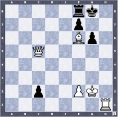

# Colecções: listas, dicionários e sets


## ex01
Escreva a função `remove_multiplos` que recebe uma
lista de inteiros e um inteiro e devolve a lista que resulta de remover
todos os elementos da lista original que são múltiplos do segundo argumento.
Por exemplo:
```
>>> remove_multiplos([2, 3, 5, 9, 12, 33, 34, 45], 3)
[2, 5, 34]
```

## ex02
Escreva a função, `soma_cumulativa` que recebe uma lista de números e
devolve uma lista que contém a soma cumulativa da lista recebida, ou
seja, o elemento na posição i da lista devolvida contém a soma de todos os
elementos da lista original nas posições de 0 a i. Não é necessário validar
os dados de entrada. Por exemplo,
```
>>> soma_cumulativa([1, 2, 3, 4, 5])
[1, 3, 6, 10, 15]
```

## ex03
Uma matriz é uma tabela bidimensional em que os seus elementos são
referenciados pela linha e pela coluna em que se encontram. Uma matriz pode ser representada como uma lista cujos elementos são listas, cada
uma destas sub-listas representa uma linha. Com base nesta representação, escreva a função `elemento_matriz` que recebe três argumentos, uma
matriz, uma linha e uma coluna, e que devolve o elemento da matriz que
se encontra na linha e coluna indicadas. A sua função deve permitir a
seguinte interação:
```
>>> m = [[1, 2, 3], [4, 5, 6]]
>>> elemento_matriz(m, 0, 0)
1
>>> elemento_matriz(m, 0, 3)
ValueError: elemento_matriz: indice invalido, coluna 3
```

## ex04
Considere a definição de matriz do exercício anterior. Escreva a função
`print_matriz` que recebe uma matriz e que a escreve sob a seguinte forma
```
a11 a21 ··· an1
a12 a22 ··· an2
··· ··· ··· ...
a1n a2n ··· ann
```

## ex05
Considere a definição de matriz dos exercícios anteriores.
Escreva a função `soma_matriz` que recebe
como argumentos duas matrizes e devolve a matriz que resulta da sua
soma. Sendo `a` e `b` as matrizes a
somar, os elementos da matriz produto são dados por

Por exemplo:
```
m1 = [[1, 2, 3], [4, 5, 6], [7, 8, 9]]
m2 = [[1, 2, 3], [4, 5, 6], [7, 8, 9]]
print_matriz(soma_mat(m1, m2))
2 4 6
8 10 12
14 16 18
```

## ex06
Considere a definição de matriz dos exercícios anteriores escreva a
função `multiplica_mat` que recebe como argumentos duas matrizes e
devolve a matriz que resulta do produto de uma pela outra. Sendo `a` e `b` as
matrizes a multiplicar, os elementos da matriz produto são dados por


## ex07
A sequência de Racamán,
0, 1, 3, 6, 2, 7, 13, 20, 12, 21, 11, 22, 10, 23, 9, 24, . . .
é uma sequência de números inteiros não negativos definida do seguinte
modo:
(1) o primeiro termo da sequência é zero;
(2) se o termo anterior ao `n`-ésimo termo for maior do que `n` e se o
resultado de subtrair `n` ao termo anterior ainda não apareceu na sequência,
neste caso o `n`-ésimo termo é dado pela subtração entre o `(n-1)`-ésimo
termo e `n`;
(3) em caso contrário o `n`-ésimo termo é dado pela soma do `(n-1)`-ésimo
termo com `n`. Ou seja,

- `0` se `n = 0`

- `r(n-1)-n` se >n\land(r(n-1)-n)\notin\{r(i):i<n\})

- `r(n 1) + n` em caso contrário

Escreva uma função `seq_racaman` que recebe um inteiro positivo, `n`, e devolve uma
lista contendo os `n` primeiros elementos da sequência de Racamán. Por
exemplo:
```
>>> seq_racaman(15)
[0, 1, 3, 6, 2, 7, 13, 20, 12, 21, 11, 22, 10, 23, 9]
```

## ex08
Escreva a função `numero_occ_lista` que recebe uma lista e um número, e
devolve o número de vezes que o número ocorre na lista e nas suas sublistas,
se existirem. Não é necessário validar os argumentos. Por exemplo,
```
>>> num_occ_lista([1, 2, 3, 4, 3], 3)
2
>>> num_occ_lista([1, [[[1]], 2], [[[2]]], 2], 2)
3
```

## ex09
Uma chave do euromilhões é constituída por cinco inteiros diferentes e ordenados,
entre 1 e 50 e por dois números diferentes e também ordenados, entre 1 e 12.
Escreva uma função `euromilhoes` sem argumentos que devolve
aleatoriamente uma lista contendo duas listas, cada uma delas contendo
os constituintes de uma chave do euromilhões. Para a geração de números
aleatórios utilize a função `random()`, existente na biblioteca random, que
devolve aleatoriamente um real no intervalo [0, 1[.

## ex10
Considere a seguinte lista de dicionários na qual os significados dos campos
são óbvios:
```
l_nomes = [{'nome':{'nomep':'Jose', 'apelido':'Silva'},
'morada':{'rua':'R. dos douradores', 'num': 34, 'andar':'6 Esq',
'localidade':'Lisboa', 'estado':'', 'cp':'1100-032',
'pais':'Portugal'}}, {'nome':{'nomep':'John', 'apelido':'Doe'},
'morada':{'rua':'West Hazeltine Ave.', 'num': 57, 'andar':'',
'localidade':'Kenmore', 'estado':'NY', 'cp':'14317', 'pais':'USA'}}]
```
Diga quais são os valores dos seguintes nomes:

- (a) l_nomes[1]
- (b) l_nomes[1]['nome']
- (c) l_nomes[1]['nome']['apelido']
- (d) l_nomes[1]['nome']['apelido'][0]

## ex11
Escreva a função `agrupa_por_chave` que recebe uma lista de pares
contendo uma chave e uma valor, `(k, v)` e devolve um dicionário que
associa a lista com os valores `v` encontrados para cada chave `k`.
Por exemplo:
```
>>> agrupa_por_chave([('a', 8), ('b', 9), ('a', 3)])
{'a': [8, 3], 'b': [9]}
```

## ex12
Uma carta de jogar é caracterizada por um naipe *(espadas, copas, ouros
e paus)* e por um valor *(A, 2, 3, 4, 5, 6, 7, 8, 9, 10, J, Q, K)*. Uma carta
pode ser representada por um dicionário com duas chaves, `np` e `vlr`,
sendo um conjunto de cartas representado por uma lista de cartas.
- (a) Escreva uma função `baralho` que devolve uma lista contendo todas
as cartas de um baralho. Por exemplo,
```
>>> baralho()
[{'np': 'esp', 'vlr': 'A'}, {'np': 'esp', 'vlr': '2'},
{'np': 'esp', 'vlr': '3'}, {'np': 'esp', 'vlr': '4'},
{'np': 'esp', 'vlr': '5'}, {'np': 'esp', 'vlr': '6'},
{'np': 'esp', 'vlr': '7'}, {'np': 'esp', 'vlr': '8'},
{'np': 'esp', 'vlr': '9'}, {'np': 'esp', 'vlr': '10'},
{'np': 'esp', 'vlr': 'J'}, {'np': 'esp', 'vlr': 'Q'},
{'np': 'esp', 'vlr': 'K'}, {'np': 'copas', 'vlr': 'A'},
{'np': 'copas', 'vlr': '2'}, {'np': 'copas', 'vlr': '3'},
... }
```
- (b) Recorrendo à função `random()`, a qual produz um número aleatório
no intervalo `[0, 1[`, escreva a função `baralha` que recebe uma lista
correspondente a um baralho de cartas e baralha aleatoriamente essas cartas, devolvendo a lista que corresponde às cartas baralhadas devolvendo a lista
com as cartas baralhadas.
Sugestão: percorra sucessivamente as cartas do baralho trocando
cada uma delas por uma outra carta seleccionada aleatoriamente.
Por exemplo,
```
>>> baralha(baralho())
[{'np': 'esp', 'vlr': '3'}, {'np': 'esp', 'vlr': '9'},
{'np': 'copas', 'vlr': '6'}, {'np': 'esp', 'vlr': 'Q'},
{'np': 'esp', 'vlr': '7'}, {'np': 'copas', 'vlr': '8'},
{'np': 'copas', 'vlr': 'J'}, {'np': 'esp', 'vlr': 'K'},
... ]
```
- (c) Escreva uma função `distribui` que recebe um baralho de cartas e as
distribui por quatro jogadores, devolvendo uma lista que contém a lista de
cartas de cada jogador. O seu programa deve garantir que o número
de cartas a distribuir é um múltiplo de 4. Por exemplo,
```
distribui(baralha(baralho()))
[[{'np': 'ouros', 'vlr': 'A'}, {'np': 'copas', 'vlr': '7'},
{'np': 'paus', 'vlr': 'A'}, {'np': 'esp', 'vlr': 'J'},
{'np': 'paus', 'vlr': '6'}, {'np': 'esp', 'vlr': '10'},
{'np': 'copas', 'vlr': '5'}, {'np': 'esp', 'vlr': '6'},
{'np': 'copas', 'vlr': '8'}, {'np': 'esp', 'vlr': '3'},
{'np': 'ouros', 'vlr': '5'}, {'np': 'ouros', 'vlr': '8'},
{'np': 'copas', 'vlr': 'K'}],
[{'np': 'paus', 'vlr': '2'}, {'np': 'esp', 'vlr': '2'},
...]]
```

## ex13
Considere um dicionário que contém as notas finais dos alunos de FP.
As chaves do dicionário correspondem às notas obtidas pelas alunos,
as quais devem ser números inteiros entre `0` e `20`, e os valores
correspondem à lista dos alunos com essa nota (representados pelos números).
Por exemplo, o dicionário poderá ser:
```
notas_dict = {1 : [46592, 49212, 90300, 59312], \
15 : [52592, 59212], 20 : [58323]}
```
Escreva a função `resumo_FP` que recebe um dicionário com as notas finais
dos alunos de FP e devolve um tuplo, com dois elementos, contendo a média
dos alunos aprovados e o número de alunos reprovados. Por exemplo:
```
>>> resumo_FP(notas_dict)
(16.666666666666668, 4)
```

## ex14
Escreva a função, `metabolismo` que recebe um dicionário cujas chaves
correspondem a nomes de pessoas e cujos valores correspondem a tuplos
contendo o género, a idade, a altura e o peso dessa pessoa. A sua função
deverá devolver um dicionário que associa a cada pessoa o seu índice de
metabolismo basal. Sendo s o género, i a idade, h a altura e p o peso de uma
pessoa, o metabolismo basal, m, é definido do seguinte modo:
m(s, i, h, p) =
- 66 + 6.3 * p + 12.9 * h + 6.8 * i se s = M
- 655 + 4.3 * p + 4.7 * h + 4.7 * i se s = F

Não é necessário validar os dados de entrada. Por exemplo:
```
>>> d = {'Maria' : ('F', 34, 1.65, 64), 'Pedro': ('M', 34, 1.65, 64),
'Ana': ('F', 54, 1.65, 120), 'Hugo': ('M', 12, 1.82, 75)}
>>> metabolismo(d)
{'Ana': 1432.555, 'Hugo': 643.578, 'Maria': 1097.755, 'Pedro': 721.685}
```

## ex15
Escreva uma função `conta_palavras` que recebe uma cadeia de caracteres correspondente
a um texto e que produz uma lista com todas as palavras que este contém,
juntamente com o número de vezes que essa palavra aparece no texto. Sugestão: guarde cada palavra como uma entrada num dicionário contendo
o número de vezes que esta apareceu no texto. por exemplo,
```
>>> cc = 'a aranha arranha a ra a ra arranha a aranha ' \
+ 'nem a aranha arranha a ra nem a ra arranha a aranha'
>>> conta_palavras(cc)
{'aranha': 4, 'arranha': 4, 'ra': 4, 'a': 8, 'nem': 2}
```

## ex16
Usando a ordenação por borbulhamento, escreva a função `mostra_ordenado`
que apresenta por ordem alfabética os resultados produzidos pelo exercício
anterior. Por exemplo,
```
>>> mostra_ordenado(conta_palavras(cc))
a 8
aranha 4
arranha 4
nem 2
ra 4
```

## ex17
Escreva a função `soma_dicionarios` que recebe dois dicionários, cujos valores
associados às chaves correspondem a listas. A função deverá devolver
um dicionário com todas as chaves existentes em pelo menos um dos
dicionários e todos os valores associados a cada uma delas em ambos os
dicionários.  Por exemplo:
```
>>> d1 = {'a' : [1, 2], 'b' : [3, 4]}
>>> d2 = {'b' : [4, 5], 'c' : [6, 7]}
>>> soma_dicionarios (d1, d2)
{'a': [1, 2], 'b': [3, 4, 5], 'c': [6, 7]}
```

## ex18
Suponha que `bib` é uma lista cujos elementos são dicionários e que contém
a informação sobre os livros existentes numa biblioteca. Cada livro é
caracterizado pelo seus autores, título, casa editora, cidade de publicação,
ano de publicação, número de páginas e ISBN. Por exemplo, a seguinte
lista corresponde a uma biblioteca com dois livros:
```
[{'autores': ['G. Arroz', 'J. Monteiro', 'A. Oliveira'],
'titulo': 'Arquitectura de computadores', 'editor': 'IST Press',
'cidade': 'Lisboa', 'ano': 2007, 'numpags': 799,
'isbn': '978-972-8469-54-2'}, {'autores': ['J.P. Martins'],
'titulo': 'Logica e Raciocinio', 'editor': 'College Publications',
'cidade': 'Londres', 'ano': 2014, 'numpags': 438,
'isbn': '978-1-84890-125-4'}]
```

Escreva uma função `mais_antigo` que recebe a informação de uma biblioteca e devolve o título do livro mais antigo. Por exemplo:
```
>>> mais_antigo(bib)
'Arquitectura de computadores'
```

## ex19
Um número racional na forma canónica é um número da forma `n/d` em
que `n` e `d` são inteiros, `d != 0` e `n` e `d` são primos entre si.
Suponha que o número racional `n/d` era representado pelo dicionário
`{'num': n, 'den': d}`.
- (a) Escreva a função `cria_racional` que recebe dois inteiros e devolve
o dicionário correspondente ao racional cujo numerador é o primeiro
inteiro e cujo denominador é o segundo inteiro. A sua função deve
fazer a verificação dos dados de entrada. Por exemplo,
```
>>> cria_racional(4, 6)
{'den': 3, 'num': 2}
>>> cria_racional(4, 0)
ValueError: o denominador não pode ser 0
>>> cria_racional(4.3, 2)
ValueError: os números devem ser inteiros
```
- (b) Escreva a função `escreve_racional` que recebe um dicionário correspondente a um racional e escreve o racional sob a forma `n/d`. Por
exemplo,
```
>>> escreve_racional(cria_racional(4, 6))
2/3
```
- (c) Escreva a função, `soma_racionais` que recebe dois dicionários
correspondentes a dois racionais e devolve o número racional correspondente
à sua soma. A soma dos racionais `a/b` e `d/e` é dada por
`(a * e + d * b)/(b * e)` Por exemplo,
```
>>> escreve_racional(soma_racionais(cria_racional(4, 6), \
cria_racional(2, 3)))
4/3
```

## ex20
Um tabuleiro de xadrez tem 64 posições organizadas em 8 linhas e 8 colunas.
As linhas são numeradas de `1` a `8` e as colunas de `A` a `H`,
sendo `1, A` a posição inferior esquerda.
Neste tabuleiro são colocadas peças de
duas cores *(brancas e pretas)* e de diferentes tipos
*(rei, rainha, bispo, torre, cavalo e peão)*.
Um tabuleiro de xadrez pode ser representado
por um dicionário cujos elementos são do tipo `(l, c): (cor, t)`. Por
exemplo o elemento do dicionário `(5, 'C'): (branca, rainha)` indica
que a rainha branca está na segunda linha, terceira coluna (Figura 8.1).
A situação do jogo de xadrez apresentado na Figura 8.1 é representada
pelo seguinte dicionário:
Figura 8.1: Tabuleiro de xadrez.

```
j = {(1, 'H'): ('branca', 'torre'), (2, 'F'): ('branca', 'peao'), \
(2, 'G'): ('branca', 'rei'), (6, 'F'): ('branca', 'bispo'), \
(5, 'C'): ('branca', 'rainha'), (6, 'G'): ('preta', 'peao'), \
(7, 'F'): ('preta', 'peao'), (8, 'F'): ('preta', 'torre'), \
(8, 'G'): ('preta', 'rei'), (2, 'C'): ('preta', 'peao')}
```

Num jogo de xadrez, a rainha movimenta-se na vertical, na horizontal ou
nas diagonais e pode atacar qualquer peça da cor contrária numa destas
direções sem que existam peças da mesma cor no caminho.
Escreva uma função `ataques_rainhas` que recebe um tabuleiro de
xadrez e determina quais as peças que podem ser atacadas pelas rainhas.
Por exemplo,
```
>>> ataques_rainhas(j)
[['peao', 'preta', (2, 'C')], ['torre', 'preta', (8, 'F')]]
```
