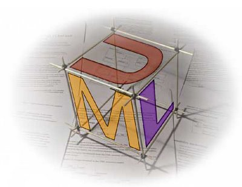

# Modelação: UML (diagrama de classes)



Para visualizar os resultados da modelação **UML** graficamente pode
utilizar a ferramenta [plantuml]: (https://plantuml.com/).
Para instalar a ferramenta em **python** utilize o comando
`pip install plantuml` e converta os ficheiros **.uml** em imagens
**.png** com o comando `python3 -m plantuml diagrama.uml`, obtendo
um ficheiro *diagrama.png*.
Alternativamente pode usar o [yuml]: (https://yuml.me/diagram/scruffy/class/draw), igualmente instalado com `pip`: `yuml -i diagrama.yuml -o diagrama.png -v`.
Se obtiver um erro aplique o patch disponível neste diretório: `patch < yuml.patch` no local da instalação, provavelmente: $HOME/.local/bin

Modelize os seguinte domínios utilizando o diagrama de classes UML.

## ex01
[ex01]: # (pneu)
Considere o seguinte domínio de aplicação:
Um pneu tem uma dada pressão de ar.
Cada pneu tem também uma pressão de ar recomendada.
Um pneu quando é criado tem uma dada pressão de ar e sabe também a sua pressão de ar recomendada.
Pode-se saber a pressão de ar e a pressão recomendada de um dado pneu.
Não deve ser possível alterar a pressão de ar recomendada de um pneu.
É possível saber se um pneu está vazio ou não.
O pneu está vazio caso a sua pressão de ar seja inferior a 80% da pressão de ar recomendada.
É possível alterar a pressão de ar de um pneu.
Se o pneu passar a ter uma pressão de ar superior a 150% da pressão de ar recomendada, então o pneu estoira (fica com um furo) e fica com uma pressão de ar igual a 0.
Quando um pneu tem um furo já não é possível alterar a sua pressão de ar.
É possível saber se um pneu tem um furo ou não.

## ex02
[ex02]: # (quilometragem)
Um carro tem sempre uma marca, quilometragem, velocidade máxima e quatro pneus.
Quando o carro é criado a sua quilometragem é igual 0.
É possível saber a quilometragem do carro, a sua marca e se algum dos seus pneus está vazio.
A marca é representada simplesmente por uma cadeia de caracteres.
É possível também alterar o valor da quilometragem do carro.
É possível montar novos pneus no carro.
Os pneus são montados no carro numa única operação, a qual recebe os novos pneus a montar.
Esta operação só será possível se todos os pneus tiverem a mesma pressão de ar recomendada.
A operação de montagem deve devolver se houve sucesso a montar os pneus ou não.

## ex03
[ex03]: # caneta()
Uma caneta tem uma dada capacidade de tinta, cor e uma marca.
A caneta mantém ainda a quantidade de tinta que tem.
Quando se cria uma caneta é necessário indicar a sua marca, capacidade de tinta e cor.
Uma caneta quando é criada está sempre cheia.
A marca e a cor são representadas por uma cadeia de caracteres.
Uma caneta pode escrever, ser recarregada e indicar a sua cor e quantidade de tinta ainda disponível.
A operação de escrever recebe a cadeia de caracteres a escrever no terminal.
Esta cadeia de caracteres só é escrita caso a caneta ainda tenha tinta (não interessa a quantidade).
Escrever uma cadeia de caracteres gasta uma quantidade de tinta igual ao número de caracteres a escrever (o método len() devolve o número de caracteres da cadeia de caracteres).
Atenção que a quantidade de tinta não pode ficar um número negativo.
A operação de recarregar recebe como a argumento a quantidade de tinta a adicionar e deve ter em conta a capacidade da caneta.
Deve devolver a quantidade de tinta não utilizada no carregamento.

## ex04
[ex04]: # (gate)
Realize uma classe que concretiza uma porta lógica `AND` com duas entradas.
Esta classe deve chamar-se `AndGate` e ter, entre outras que sejam (justificadamente) julgadas necessárias, as seguintes funcionalidades:

Uma porta lógica `AND` pode ser criada já com valores iniciais para as suas entradas ou então pode ser criada com o valor por omissão "False" para as duas entradas;
- Dois métodos que permitem alterar de forma isolada cada uma das entradas;
- Um método, designado `get_output`, que indica qual o valor da saída, tendo em conta o estado actual das duas entradas.

Realize uma nova classe que concretiza uma porta lógica `AND` com três entradas.
Esta classe deve chamar-se `TernaryAndGate` e ter, entre outras que sejam (justificadamente) julgadas necessárias, as seguintes funcionalidades:

- Três métodos que permitem definir o valor de cada uma das entradas;
- Um método, designado `get_output`, que devolve o valor do resultado da operação lógica, tendo em conta o valor actual das três entradas;
A funcionalidade desta classe deve ser concretizada usando a classe anterior.
Uma `AND` de três entradas pode ser vista como a composição de duas `AND` de duas entradas em que a saída da primeira `AND` é uma das entradas da segunda `AND`.

Por outro lado, uma `AND` de três entradas pode ser vista como uma `AND` de duas entradas com mais uma entrada, ou seja, uma extensão de uma `AND` de duas entradas.
Concretize também esta segunda solução como `AndGate3`.

## ex05
[ex05]: # (editor)
Considere um editor gráfico que é responsável por gerir as várias formas que podem ser criadas pelo utilizador.
Cada forma tem um identificador único (um número inteiro) que deve ser determinado no momento da criação da forma.
Todas as formas tem um ponto, designado como ponto de origem.
Uma forma pode estar associada ou não a um editor.
Uma forma suporta fundamentalmente duas funcionalidades:

- `mover` - recebe dois valores inteiros como argumento e realiza o deslocamento, da forma nos eixos `x` e `y`;
- `desenhar` - desenha a forma; neste caso basta devolver uma cadeia de caracteres com os dados específicos da forma: `identificador Tipo[origem restantes características]`
A aplicação deve suportar vários tipos de forma, cada um deles com os seus dados específicos e comportamentos potencialmente diferentes:

- `Quadrado` - é caratcterizado por um ponto (canto inferior esquerdo) e pelo tamanho do lado.
Este ponto corresponde ao ponto de origem para este tipo de forma.
Desenhar um quadrado corresponde a escrever o valor do canto e o tamanho do lado.
Mover um quadrado corresponde a deslocar o canto;
- `Linha` - é caracterizada por dois pontos (as extremidades da linha).
O ponto de origem corresponde ao primeiro extremo da linha.
Desenhar uma linha corresponde a escrever os pontos.
Mover uma linha corresponde a deslocar os dois pontos;
- `Círculo` - é caracterizado por um ponto (centro do círculo) e pelo raio.
Desenhar um círculo corresponde a escrever os valores do centro e do raio.
Mover um círculo corresponde a deslocar o centro. O centro de um círculo corresponde ao ponto de origem.
Nota: O tipo de cada forma (a apresentar no método desenhar) corresponde ao nome da classe da forma.
Modele este domínio utilizando o diagrama de classes UML.

## ex06
[ex06]: # (empresa)
Uma empresa tem funcionários.
Um funcionário tem um nome, um identificador único e um salário.
Dois funcionários são iguais se tiverem o mesmo identificador.
Uma empresa deve ter as seguintes funcionalidades:
adicionar um funcionário à empresa mas não pode haver dois funcionários com o mesmo identificador;
caso o novo funcionário seja igual a um já existente, então não deve ser adicionado;
obter os funcionários que tenham um salário superior a um dado valor;
caso não exista nenhum funcionário nas condições indicadas então deve ser devolvida uma lista vazia;
remover os funcionários cujo nome começa com uma dada cadeia de caracteres (utilizar o método startswith da classe **str**);
devolver uma colecção de funcionários ordenados por salário e nome.

## ex07
[ex07]: # (estojo)
Um estojo serve para guardar lápis.
Um lápis tem uma marca e uma cor.
Dois lápis são iguais se tiverem a mesma marca e cor.
A marca e a cor são representadas por uma cadeiade caracteres.
Um estojo tem uma dada capacidade.
A capacidade deve ser definida no momento da criação do estojo.
O estojo deve ter a seguinte funcionalidade:
- adição de um lápis;
- obter todos os lápis iguais a um dado lápis;
a colecção devolvida deve ter em conta a ordem pela qual os lápis foram inseridos no estojo;
- remover um dado lápis;
- remover todos os lápis que tenham uma dada cor;
- obter a lista de lápis ordenados (alfabeticamente) de forma crescente por marca e cor;
note que esta ordenação não deve alterar a ordem pela qual os lápis são mantidos no estojo;
- obter a lista de lápis do estojo pela ordem em que eles foram inseridos.

## ex08
[ex08]: # (navio)
Um navio tem tripulantes.
Cada tripulante tem um nome, um ano de nascimento e um salário.
Cada tripulante tem um identificador único no contexto do navio, o qual é atribuído automaticamente pela aplicação.
O navio tem que suportar a seguinte funcionalidade:
- manter o conjunto de tripulantes do navio;
- aceder rapidamente ao tripulante que tem um dado identificador;
- obter o conjunto de tripulantes do navio que têm um salário inferior a um dado valor;
- remover o tripulante um dado identificador;
deve ser devolvido se a operação teve sucesso ou não;
- remover todos os tripulantes cujo ano de nascimento seja inferior a um dado valor.

## ex09
[ex09]: # (coffee)
Considere a classe seguinte que representa uma chávena de café.
```
class CoffeeCup:
    def __init__(self, val: int, quantity: int):
        self._temperature = val
        self._quantity_of_coffee = quantity

    def get_temperature(self) -> int:
        return self._temperature;

    def drink(self):
        if self._quantity_of_coffee == 0:
            raise EmptyCupException()
        self._quantity_of_coffee = 0
    # ...
```
a classe `EmptyCupException` também está definida no mesmo package.

Concretize a entidade `Person`, a qual representa uma pessoa que pode beber café.
Cada pessoa tem o seu intervalo de temperatura `[x, y]` ideal para a temperatura do café: considera que o café está frio (se a temperatura da chávena de café for inferior a `x`) ou está quente (se for superior a `y`).
Concretize esta classe que deve ter pelo menos o método que representa a funcionalidade de beber uma chávena de café.
As situações de café frio ou quente devem ser representadas como excepções a definir.
Estas excepções devem guardar a temperatura do café e a sua mensagem de erro deverá ser personalizada.
No caso da excepção temperatura alta, a mensagem deve ser `"Temperatura do café demasiado quente: "` seguido da temperatura do café.
Para o caso da excepção temperatura fria, a mensagem de erro é semelhante, substituindo quente for frio.
Concretize também estas excepções.
Finalmente, caso a chávena de café esteja vazia quando uma pessoa a tenta beber (e supondo que não está fria nem quente), então deve ser escrito a mensagem `"chávena vazia!"` no écran e deve ser lançada a excepção `EmptyCupException`.

Suponha a gora que a classe `CoffeeCup` tem agora três novas funcionalidades:
`fill()`, que enche a chávena;
caso a chávena esteja vazia, então lança a excepção `AlreadyFullException`;
`heat()`, que aquece a chávena de café;
`cool()`, que arrefece a chávena de café.
Concretize o método public boolean `serve_customer(person: Person, coffeee: CoffeeCup)` da classe `CoffeeShop` que representa a funcionalidade de o cliente indicado beber a chávena de café fornecida e tem o seguinte comportamento:
Caso o cliente consiga beber a chávena sem qualquer problema, então devolve `True`;
Se acontecer algum erro, então tenta recuperar do erro e tenta volta a tentar que o cliente beba o café:
- se a chávena de café estiver quente, então a chávena deve ser arrefecido;
- se a chávena de café estiver fria, então a chávena deve ser aquecida;
- se a chávena de café estiver vazia, então a chávena deve ser enchida.
Só se tenta recuperar de dois erros.
Caso não se consiga que o cliente beba o café ao fim de três tentativas, então este método deve devolver `False`.
Em qualquer situação, sempre que o cliente bebeu ou tentou beber o café deve ser apresentado a mensagem `"Café servido!"`.

## ex10
[ex10]: # (ingrediente)
Uma refeição é constituída por um ou mais ingredientes e cada ingrediente tem um dado grupo alimentar (representado por uma cadeia de caracteres) e um preço.
Existem dois tipos de refeições: quentes e frias.
É possível adicionar ingredientes a uma refeição.
Cada refeição sabe calcular o seu preço e tem um nome.
O preço de uma refeição é calculado tendo em conta o preço dos seus ingredientes e o tipo da refeição.
Uma refeição fria tem um custo adicional de 50 cêntimos, enquanto que uma refeição quente tem um custo adicional de 75 cêntimos. Os ingredientes podem também ser indicados no momento da criação da refeição.

A solução deve prever a possibilidade de os dois tipos de refeição poderem vir a ter funcionalidades diferentes. 

## ex11
[ex11]: # (fabrica)
Uma fábrica tem um número variável de empregados e tem como funcionalidade principal fabricar.
Quando uma fábrica trabalha, todos os seus empregados são colocados a trabalhar.
Cada empregado tem um nome, um ano de nascimento e trabalha.
É possível saber o nome e o ano de nascimento de um empregado.
Existem dois tipos de empregados, operário e gestor.
Cada tipo de empregado tem o seu próprio comportamento no que diz respeito ao método `trabalha`.
Para simplificar, considere que, quando um gestor trabalha a mensagem "Gestor X a gerir" é escrita no terminal, enquanto que, quando um operário trabalha a mensagem escrita é "Operário X a trabalhar". Em ambos os casos, X deve ser substituido pelo nome do empregado em causa.

## ex12
[ex12]: # (revistas)
Uma empresa produz livros e revistas.
Cada publicação é identificada univocamente pelo seu nome e número de registo.
Um livro tem ainda um conjunto de autores.
Cada revista é constituída por um conjunto de artigos, em que cada artigo tem um título e um conjunto de autores.
Cada autor é representado apenas pelo seu nome.
Pode haver autores com o mesmo nome.
A empresa produz publicações e mantém as publicações produzidas.
Além de manter as publicações, a empresa permite realizar procuras sobre as publicações existentes:

- edvolve a publicação com um dado nome e número de registo;
- devolve todas as publicações que contêm um dado autor;
considere que uma revista tem um dado autor se pelo menos um dos artigos da revista tiver o autor como um dos autores do artigo.

## ex13
[ex13]: # (software)
Uma empresa de consultoria na área de desenvolvimento de software realiza assistência a projectos de desenvolvimento de software .
A empresa de consultoria tem empregados: gestores, programadores normais e programadores peritos.
Cada empregado realiza um tipo de trabalho específico, o gestor gere um projecto, o programador normal programa e o programador perito programa muito.
Adicionalmente, cada tipo de trabalhador tem um custo distinto: o gestor custa 1000 euros, o programador normal custa 1500 euros e o programador perito custa 10000 euros. 
No contexto de um projecto, a empresa de consultoria pode atribuir o projecto a um dos seus empregados ou pode constituir uma equipa com vários dos seus empregados (podendo ainda agrupar os empregados em sub-equipas) e atribuir a equipa ao projecto.
O custo do projecto depende do custo dos empregados atribuídos ao projecto:

No caso em que o projeto está atribuído a um único empregado, o custo do projecto é igual ao custo deste empregado.
No caso em que o projecto está atribuído a uma equipa, o custo do projecto é igual ao custo dos vários empregados envolvidos na equipa.
O projecto deverá suportar a funcionalidade realizar trabalho que deverá corresponder a invocar a funcionalidade de trabalhar dos vários empregados envolvidos:

No caso em que o projeto está atribuído a um único empregado, apenas se considera o trabalho realizado por este empregado.
No caso em que o projecto está atribuído a uma equipa, então tem que se considerar o trabalho de todos os empregados envolvidos na equipa.
Modele o problema por forma a que o código da entidade projecto não necessite de distinguir se está atribuído a um empregado individual ou a uma equipa.

## ex14
[ex14]: # (estudante)
Considere a seguinte hierarquia de classes que tem como superclasse `Pessoa`: `Empregado` e `Estudante` herdam de `Pessoa`; `Professor` herda de `Empregado`; e `AlunoMestrado` herda de `Estudante`.
A superclasse `Pessoa` define várias funcionalidades, cada uma delas representada por um método abstracto que é depois concretizado de forma diferente em cada uma das subclasses da hierarquia.
Um dos métodos abstractos é o método `void trabalha()` que representa a funcionalidade de trabalhar.
Cada classe tem uma definição do método trabalhar, que encapsula o comportamento dessa pessoa.
Pretende-se agora poder ter a possibilidade de acrescentar novo comportamento extra a cada uma das funcionalidades.
Por exemplo, ter um conhecimento do trabalho realizado para uma dada pessoa, ou seja, saber quando uma pessoa começou e terminou de trabalhar.
Podemos querer compor vários comportamentos extra.
Por forma a não alterar as entidades já existentes, exemplifique a concretização do comportamento extra do registo do início/fim de trabalho, o qual corresponderá a escrever as mensagens `"Comecei a trabalhar"` e `"Acabei de trabalhar"` antes e depois de o método trabalha de uma pessoa com registo de fim e início de trabalho ser invocado.
Por razões de simplificação considere que apenas existe o método abstracto `trabalha` em `Pessoa`.

## ex15
[ex15]: # (cliente)
Os clientes de uma empresa são identificados pelo nome (cadeia de caracteres) e possuem um número de telefone.
Para cada cliente, a empresa mantém um registo das vendas realizadas.
Cada vez que um cliente realiza uma dada compra o método `realiza_compra(Venda d)` de `Cliente` é invocado com a compra efectuada (a classe venda mantém o item comprado e o seu preço).
Os clientes inicialmente não usufruem de descontos.
No entanto, à medida que vão fazendo compras, o processo de fidelização da empresa vai introduzindo benefícios para clientes frequentes.
Assim, para clientes que façam pelo menos cinco compras, o desconto passa para 5%; para clientes que façam pelo menos 100 compras, o desconto passa para 10%; se o cliente fizer mais do que 1000 compras, o desconto passa para 15%.
Deve ser possível introduzir novas modalidades de recompensa, as quais podem depender de outros factores relacionados com o cliente (por exemplo o valor das compras efectuadas) e novas funcionalidades dependentes do escalão do cliente (por exemplo aceder a promoções) com um custo reduzido no código já existente .
Assim, deve ser fácil realizar as novas alterações no código já existente. Aplique um ou mais padrões de desenho por forma a concretizar este requisito.

## ex16
[ex16]: # (loja)
Uma loja tem produtos para vender e clientes.
Um produto tem uma descrição e um preço.
A loja permite colocar um produto em promoção através do método `coloca_em_promocao` definido em `Loja`.
Este método recebe como argumentos o produto a colocar em promoção e o valor do desconto a a aplicar (um número inteiro entre `0` e `100`).
Considere agora que quer concretizar o seguinte requisito: Por forma a optimizar as suas vendas, é importante que cada loja seja capaz de avisar os clientes que tenham mostrado interesse nos produtos em promoção.
Em qualquer instante, um cliente pode mostrar interesse em ser avisado sempre que a loja coloca um produto em promoção ou pode cancelar o seu interesse.
Além dos clientes, a solução deverá permitir que outros tipos de entidades possam vir também a poder mostrar interesse em serem avisadas quando um produto fica em promoção.
Na solução encontrada, considere que sempre que um cliente recebe a notificação de um produto em promoção, deve ser escrito no terminal a descrição e preço do produto em promoção e o seu valor de desconto.

## ex17
[ex17]: # (arcondicionado)
Considere a seguinte classe:
```
class ArCondicionado:

  def __aquece(self): pass
  def __arrefece(self): pass
  def __coloca_velocidade(self, vel: int): pass

  def desliga(self): pass
  def liga(self): pass

  def altera_velocidade(self): pass

  def troca(self): pass

  def obtem_funcionamento(self) -> str: pass
}
```

que representa a interface de um aparelho de ar condicionado.
Este aparelho permite aquecer ou arrefecer e tem três velociades de ventilação (representados pelos números 1, 2 e 3).
É possível ligar ou desligar o aparelho (via métodos `liga()` e `desliga()`).
Quando se liga um aparelho, o aparelho aquece com velocidade 1.
A velocidade do aparelho depende se está a aquecer ou a arrefecer.
Em aquecimento, o aparelho só tem as velociades `1` e `2`.
Em modo arrefecimento só tem as velocidades `2` e `3`.
O método `troca()` permite trocar o modo de funcionamento de um ar condicionado ligado, passando a aquecer se estiver a arrefecer e vice-versa desde que as velocidades sejam compatíveis.
Assim, só é possível trocar caso a velocidade seja `2`.
O método `altera_velocidade()` altera a velocidade de um aparelho ligado.
Por exemplo, em modo aquecimento, se a velociade for `1` passa para `2` e se for `2` passa para `1`.
Semelhante se estiver a arrefecer.
Os métodos privados `aquece()`, `arrefece()` e `coloca_velocidade()` são utilizados internamente pela classe para colocar o aparelho a realizar o pretendido.
Representando separadamente cada estado do aparelho concretize agora os métodos públicos da classe por forma a que o código seja legível e seja relativamente fácil de alterar o modo de funcionamento do ar condicionado.
O método `obtem_funcionamento()` devolve uma cadeia de caracteres que indica o modo em que o aparelho está, por exemplo, `"Desligado"` ou `"Aquecer, velocidade 1"`.

## ex18
[ex18]: # (decorator)
Considere a seguinte classe TestSpan que representa um texto:
```
class TextItem:
    def render(self) -> str: pass

class TextSpan(TextItem):
    def __init__(self, text: str):
        self._text = text;

    def render(self) -> str:
      return "<span>" + self._text + "</span>"
```
O método `render()` tem como funcionalidade devolver a cadeia de caracteres que representa o texto. 

O código actual desta classe não permite modificação do aspecto do texto, permitindo que este possa ser apresentado em negrito, itálico, sublinhado, ou em combinações variadas (e.g. negrito e itálico ou itálico sublinhado, etc.).

Pretende-se agora ter a possibilidade de poder modificar dinamicamente o aspecto de um texto sem que isso provoque alterações no código da aplicação já realizado. Represente as características gráficas da seguinte forma:

normal <span>normal</span>
negrito <b>negrito</b>
itálico <i>itálico</i>
sublinhado <u>sublinhado</u>

Considere que cada tipo de modificação que se pode realizar ao texto deriva de uma classe comum que pode ser sucessivamente aplicada.

## ex19
[ex19]: # (shape)
Suponha que lhe pediram para desenvolver uma biblioteca de formas geométricas. Como resultado produziu o seguinte código:


```
class Shape:
    def draw(self, ): pass
    def resize(self, ratio: int): pass
    def set_hidden(self, hidden: bool): pass

class Rectangle(Shape):
    def __init__(self):
        self._is_hidden = False

    def draw(self):
        if not self._is_hidden: print("Drawing Rectangle")

    def resize(self, ratio: int):
        pass # code for resizing this rectangle

    def set_hidden(self, h: bool):
        self._is_hidden = h
    # more attributes and code

class Circle(Shape):
    pass # ...
```

e desenvolveu uma aplicação de desenho que lida com os diferentes tipos de Shape existentes.
Esta aplicação segue o princípio aberto/fechado pelo que a definição de novos tipos de Shape não implica alterações no código da aplicação de desenho.

Entretanto, durante o desenvolvimento de novas formas geométricas, descobriu que havia outras formas que já tinham sido desenvolvidas no contexto de outro projecto mas que têm uma interface um pouco diferente.
De seguida apresentamos um exemplo de uma das formas geométricas desenvolvidas no contexto do outro projecto.

```
import math
class GeometricShape:
    def area() -> float: pass
    def draw_shape(): pass

class Triangle(GeometricShape):
  def __init__(self, a: float = 1, b: float = 1, c: float = 1):
    self._a = a;
    self._b = b;
    self._c = c;

  def area(self):
    s = (self._a + self._b + self._c) / 2
    return math.sqrt(s * (s - self._a) * (s - self._b) * (s - self._c))
  
  def draw_shape(self):
    print("Drawing Triangle with area:", self.area())
```

Construa uma solução que permite reutilizar o código destas formas geométricas desenvolvidas no contexto do outro projecto na aplicação de desenho.
Idealmente não deve ser necessário alterar nem a aplicação de desenho nem o o código destas formas geométricas.

Após ter construído a sua solução, considere que a interface Shape tem um método adicional (`get_description() -> str`) que deve devolver o nome da forma geométrica.
A classe `Rectangle` deve agora concretizar este método retornando a cadeia de caracteres `"Rectangle"`.
Qual o impacto deste método extra na solução desenvolvida anteriormente?

## ex20
[ex20] # (voo)
Pretende-se desenvolver uma aplicação para a gestão de voos de companhias aéreas. Esta aplicação deve permitir a definição de companhias aéreas, de novos voos, operados por uma dada companhia aérea.
Um voo tem sempre associado um número (único no contexto da companhia aérea que o gere), um aeroporto de origem e outro de destino, bem como a hora de partida (hh:mm). Existe ainda a restrição de os aeroportos de origem e destino terem de ser obrigatoriamente distintos.
Um aeroporto é identificado quer pelo seu código
[IATA](http://pt.wikipedia.org/wiki/C%C3%B3digo_aeroportu%C3%A1rio_IATA),
quer pelo seu código
[ICAO](http://pt.wikipedia.org/wiki/C%C3%B3digo_aeroportu%C3%A1rio_ICAO).
O aeroporto está instalado numa dada cidade e tem associado um custo de utilização por voo.
O código IATA e ICAO de um aeroporto são únicos dentro do contexto da aplicação de gestão de companhias aéreas, ou seja, não podem existir dois aeroportos com o mesmo código IATA ou ICAO dentro da mesma aplicação.
Por fim, uma companhia aérea tem um nome e um código IATA próprio, únicos na aplicação de gestão de companhias aéreas.
