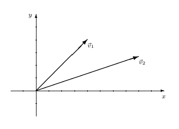

# Classes e objetos


Caso pretenda obter o diagrama de classes UML do código python que
desenvolve como resposta a cada pergunta, deve instalar o *pylint*
`python3 -m pip install pylint`  e usar o comando *pyreverse*
para cada exercício: `pyreverse ex01.py -o puml -p ex01`.
Como resultado obtém um ficheiro com o formato *plantuml* como
utilizado no laboratório anterior.

## ex01
Crie a classe `Estacionamento` cujo construtor recebe a lotação máxima do
estacionamento criado.
No estacionamento é possível um carro entrar e sair de cada vez.
Não é possível que o numero de carros seja superior à lotação máxima nem inferior a zero.
Inicialmente é criado um estacionamento sem carros estacionados.
Defina os seguintes métodos da classe estacionamento:

- `entrar`, que adiciona um carro ao estacionamento, devolve verdadeiro se existir pelo menos um lugar disponível e falso em caso contrário;
- `sair`, que remove um carro do estacionamento;
- `lotacao_maxima`, que retorna a capacidade máxima do estacionamento;
- `lotacao`, que retorna o número de carros dentro do estacionamento;

Defina também a representação do estacionamento, como nos exemplos abaixo.
Mostra-se a seguir um exemplo de interação:
```
>>> e = Estacionamento(50)
>>> e.lotacao_maxima()
50
>>> e.entrar()
True
>>> e.entrar()
True
>>> e.entrar()
True
>>> e.lotacao()
3
>>> e.sair()
>>> e
Lotacao: 2 de 50 lugares
```

## ex02
Crie a classe `Autocarro` cujo construtor recebe a capacidade de um
autocarro em número de passageiros.
O autocarro inicialmente é criado vazio. Os outros métodos suportados
pela classe são:

- `capacidade`, que devolve a capacidade total do autocarro;
- `passageiros`, que devolve o número de passageiros dentro do autocarro;
- `sai`, que recebe o número de passageiros a sair do autocarro.
	Se o número exceder o número de passageiros dentro do autocarro,
	o número de passageiros presentes passa a ser `0`;
- `entra`, que recebe o número de passageiros a entrar no autocarro.
	Se o número de passageiros a entrar no autocarro fizer com que a
	sua capacidade seja ultrapassada, o número de passageiros
	presentes no autocarro passa a ser igual à sua capacidade.

Defina também a representação do autocarro, como nos exemplos abaixo:
```
>>> a = Autocarro(30)
>>> a.passageiros()
0
>>> a.capacidade()
30
>>> a.sai(35)
>>> a.passageiros()
0
>>> a.entra(40)
>>> a.passageiros()
30
>>> a.sai(5)
>>> a.passageiros()
25
>>> print(a)
Autocarro de 30 lugares com 25 passageiros.
>>> a.sai(26)
>>> a.passageiros()
0
```

## ex03
Crie a classe `Data`, em que uma data é caracterizada por um dia
(um inteiro entre `1` e `31`), um mês (um inteiro entre `1` e `12`) e
um ano (um inteiro que pode ser positivo, nulo ou negativo).
Para cada data, deve
ser respeitado o limite de dias de cada mês, incluindo o caso de fevereiro
nos anos bissextos. Recorde que um ano é bissexto se for divisível por `4`
e não for divisível por `100`, a não ser que seja também divisível por `400`.
Por exemplo, `1984` é bissexto, `1100` não é, e `2000` é bissexto.
A classe data suporta os seguintes métodos:

- `dia`, `mes` e `ano` que devolvem, respectivamente o dia, o mês e
	o ano da data.
- `mesma` que recebe como argumento uma data e devolve o valor verdadeiro se
	a data da própria instância é igual ao argumento e falso caso
	contrário.
- `anterior` que recebe como argumento uma data e devolve o valor verdadeiro se
	a data da própria instância é anterior ao argumento e falso caso
	contrário.
- `idade` que recebe como argumento a data de nascimento de uma pessoa e
devolve a idade da pessoa, em anos.

Defina também a representação da classe `Data` como `dd/mm/aaaa ee` (em que `dd`
representa o dia, `mm` o mês, `aaaa` o ano e `ee` representa a era, a qual é omitida
se o ano for maior ou igual a `0` e é escrita `AC` se o ano for menor que zero).
Mostra-se a seguir um exemplo de interação:
```
>>> d = Data(15, 12, 2021)
>>> d
05/12/2021
>>> d.dia()
15
>>> d.mes()
12
>>> d.ano()
2021
>>> d.anterior(Data(16, 12, 2021))
True
>>> d.idade(Data(2, 1, 2003))
18
>>> d.idade(Data(2, 1, 2023))
ValueError: idade: a pessoa ainda não nasceu
>>> d = Data(15, 12, -75)
>>> d
05/12/0075 AC
```

## ex04
Suponha que quer representar o conceito de tempo de um relógio,
dividindo-o em horas, minutos e segundos. Na classe `Relogio`
o número de minutos e de segundos está compreendido entre `0` e `59` e o
número de horas está compreendido entre `0` e `24`.
Por exemplo `12:00:00` é uma representação válida da classe relógio.
A classe relógio deve suportar os seguintes métodos:

- `obter_horas`, que retorna a componente das horas do relógio;
- `obter_minutos`, que retorna a componente dos minutos do relógio;
- `obter_segundos`, que retorna a componente dos segundos do relógio;
- `igual`, que recebe outra instância de relógio e devolve o valor
	verdadeiro se o próprio relógio indicar a mesma hora que o
	argumento e falso caso contrário;
- `mais_cedo`, que recebe outra instância de relógio e devolve o valor
	verdadeiro se o próprio relógio indicar uma hora anterior ao
	argumento e falso caso contrário;

Defina também a representação do relógio, seguindo os exemplos abaixo:
```
>>> r = Relogio(20, 15, 50)
>>> r
20:15:50
>>> r.obter_horas()
20
>>> r.obter_minutos()
15
>>> r.obter_segundos()
50
>>> r.mais_cedo(Relogio(21, 15, 50))
True
```

## ex05
Defina a classe `ContadorLimitado` cujo construtor recebe dois números
inteiros, correspondendo ao limite inferior e superior do contador.
O contador quando é criado tem como valor inicial o limite inferior.
Os outros métodos suportados pela classe são:

- `consulta`, que devolve o valor do contador;
- `inc`, que permite incrementar de uma unidade o valor do contador e
	devolve o valor do contador no final.
	Se se tentar incrementar o valor do contador para cima do
	limite superior este não é alterado;
- `dec`, que permite decrementar de uma unidade o valor do contador e
	devolve o valor do contador no final.
	Se se tentar decrementar o valor do contador para baixo do
	limite inferior este não é alterado.

Defina também a representação do `contador_limitado`, seguindo os exemplos
abaixo.
Mostra-se a seguir um exemplo de interação:
```
>>> c1 = ContadorLimitado(3, 5)
>>> c1.inc()
4
>>> c1.consulta()
4
>>> c1.inc()
5
>>> c1.inc()
5
>>> c1.dec()
4
>>> c1.dec()
3
>>> c1.dec()
3
>>> print(c1)
Contador de 3 a 5 (atual 3)
```

## ex06
Defina a classe `CartaoTelefonico` cujo construtor recebe o tarifário
em vigor.
O tarifário é representado por um dicionário, em que cada tipo de chamada
é representado por uma cadeia de caracteres, a que está associado o custo
por minuto de conversação, por exemplo:
```
{'local':1, 'nacional':12, 'movel':20, 'internacional':41}
```
Os outros métodos suportados pela classe são:

- `consulta_custo`, devolve os custos das chamadas efetuadas;
- `consulta_chamadas`, devolve o número de chamadas efetuadas;
- `chamada`, efetua uma chamada, atualizando o valor dos custos.
	Recebe a tarifa e a duração da chamada em minutos.

Defina também a representação do `CartaoTelefonico`, seguindo os exemplos
abaixo:
```
>>> tarifario = {'local':1, 'nacional':12, 'movel':20, 'internacional':41}
>>> c1 = CartaoTelefonico(tarifario)
>>> c1.consulta_custo()
0
>>> c1.chamada('local', 5)
>>> c1.consulta_custo()
5
>> c1.chamada(‘nacional', 10)
>>> c1
Despesa de 125 céntimos em 2 chamadas
```

## ex07
Crie a classe `SkiRental` cujo construtor recebe o preço diário de aluguer
de um par de skis normais e de um prancha de snowboard.
Na loja é permitido fazer reservas anticipadas.
Numa reserva é dado o número de skis e snowboards que se pretendem
reservar e é devolvido o custo dessa reserva.
Defina os seguintes métodos da classe `SkiRental`:

- `preco_ski`, que retorna o preço de uns skis;
- `preco_snowboard`, que retorna o preço de um snowboard;
- `reserva` que retorna o custo de uma reserva efetuada na loja de aluguer.

Defina também a representação do `SkiRental` como nos exemplos abaixo:
```
>>> s = SkiRental(20, 35)
>>> s
Ski: 20; Snowboard: 35
>>> s.preco_ski()
20
>>> s.preco_snowboarsd()
35
>>> s.reserva(3,1)
95
```

## ex08
Deseja garantir uma numeração sequencial a todas as instâncias da classe `Id`.
Assim, cada instância da classe `Id` possui um nome e um identificador único e
sequencial, devolvidos pelos métodos `nome()` e `ident()`, respetivamente.
A numeração do identificador único deve começar em `1` com a primeira instância.
Deve ser possível saber qual o último identificador atribuído a uma instância
com o método `ultimo()` e pesquisar qual o identificador de uma instância
dado o seu nome (em caso de nomes iguais deve ser devolvida a instância mais antiga).
Para obter cada uma das instâncias já criadas, deve existir um método designado
por `ids()` que recebe o identificador desejado.
Mostra-se a seguir um exemplo de interação:
```
>>> a = Id('Ana')
>>> a.nome()
'Ana'
>>> a.ident()
1
>>> print(a)
1: Ana
>>> b = Id('Beatriz')
>>> Id.ultimo()
2
>>> Id.procura('Ana')
1
>>> x = Id.id(2)
>>> x
2: Beatrix
>>> y = Id.ids(8)
IndexError: list index out of range
```

## ex09
Suponha que desejava criar a classe `Racional`.
Um número racional é qualquer número que possa ser expresso como o
quociente de dois inteiros: o numerador (um inteiro) e o denominador
(um inteiro positivo ou negativo).
Os racionais `a/b` e `c/d` são iguais se e só se `a * d` = `b * c`.
Assuma que a representação externa de um racional é
apresentada de modo que o numerador e o denominador são primos entre si.
A classe racional admite as operações `nume` e `deno` que devolvem,
respetivamente o numerador e o denominador.

- Defina a classe `Racional`, incluindo os transformadores de saída para número real: `real`.
- Usando operações polimórficas, escreva métodos para calcular a soma
	e o produto de racionais. Se `r1 = a/b` e `r2 = c/d` então
	`r1 + r2 = (ad + bc)/bd` e `r1 * r2 = (a * c)/(b * d)`.
- Defina os operadores `==` e `!=`
- Com base nas operações básicas da classe `Racional`, escreva o método `rac_inverso(b)` que devolve o inverso de um racional.

Por exemplo,
```
>>> r1 = Racional(2, 4)
>>> r2 = Racional(1, 6)
>>> r1
1/2
>>> r2
1/6
>>> r1 + r2
2/3
>>> r1*r2
1/12
```

## ex10
Os automóveis mais recentes mostram a distância que é possível percorrer
até ser necessário um reabastecimento. Pretende-se criar esta
funcionalidade através da classe `Automovel`.
Esta classe é construída indicando a capacidade do depósito, a quantidade
de combustível no depósito e o consumo do automóvel em litros aos `100` km.
A classe automovel apresenta os seguintes métodos:

- `combustivel` devolve a quantidade de combustível no depósito;
- `autonomia` devolve o numero de Km que é possível percorrer tendo em conta
	combustível no depósito;
- `abastece(n_litros)` aumenta em `n_litros` o combustível no depósito.
	Se este abastecimento exceder a capacidade do depósito, gera
	um erro e não aumenta a quantidade de combustível no depósito;
- `percorre(n_km)` percorre `n_km` Km, desde que a quantidade de combustível
	no depósito o permita, em caso contrário gera um erro e o
	trajecto não é efectuado.

Por exemplo:
```
>>> a1 = Automovel(60, 10, 15)
>>> a1.combustivel()
10
>>> a1.autonomia()
66
>>> a1.abastece(45)
'366 Km até abstecimento'
>>> a1.percorre(150)
'216 Km até abstecimento'
>>> a1.percorre(250)
ValueError: Não tem autonomia para esta viagem
```

## ex11
Suponha que desejava criar a classe `Conjunto`, a qual apresenta métodos
correspondentes às seguintes operações básicas:

- Construtores:
	- `conjunto(e1 , . . . , en)` tem como valor um conjunto com os elementos
`e1 , . . . , en` , `(n > 0)`;
	- `duplica(c)` tem como valor um conjunto igual a `c`;
- Seletores:
	- `c.element()` tem como valor um elemento escolhido aleatoriamente do
conjunto `c`; se o conjunto for vazio esta operação é indefinida.
	- `c.cardinal()` tem como valor o número de elementos do conjunto `c`.
- Modificadores:
	- `c.insere(e)` tem como valor o resultado de inserir o elemento `e` no conjunto `c`.
	- `c.retira(e)` tem como valor o resultado de retirar do conjunto
`c` o elemento `e`; se `e` não pertencer a `c`, tem como valor `c`.
- Reconhecedores:
	- `c.vazio()` tem o valor verdadeiro se o conjunto `c` é o conjunto
vazio, e tem o valor falso, em caso contrário.
- • Testes:
	- `c.pertence(e)` tem o valor verdadeiro se o elemento `e` pertencer ao
conjunto `c` e tem o valor falso, em caso contrário.
	- `c.elements()` tem como valor um tuplo com todos os elementos do conjunto, sem ordem específica.

- (a) Defina a classe `Conjunto`, o qual permite, por exemplo,
a seguinte interação:
```
>>> c1 = Conjunto(1, 2, 3, 4)
>>> c1
{1, 2, 3, 4}
>>> c1.cardinal()
4
>>> c1.retira(3)
{1, 2, 4}
>>> c1.element()
2
```
- (b) Como parte da classe `Conjunto`, defina o método `subconjunto` em que
`c1.subconjunto(c2)` tem o valor verdadeiro, se o conjunto `c1` for um
subconjunto do conjunto `c2`, ou seja, se todos os elementos de `c1`
pertencerem a `c2` , e tem o valor falso, em caso contrário.
Por exemplo,
```
>>> c1 = Conjunto(1, 2, 3, 4)
>>> c1
{1, 2, 3, 4}
>>> c2 = Conjunto(2, 3)
>>> c2
{2, 3}
>>> c2.subconjunto(c1)
True
>>> c1.subconjunto(c2)
False
```
- (c) Como parte da classe `Conjunto`, defina o método `uniao` em que
`c1.uniao(c2)` tem como valor o conjunto união de `c1` com `c2` , ou seja,
o conjunto formado por todos os elementos que pertencem a `c1` ou a
`c2`.
Por exemplo,
```
>>> c1 = Conjunto(1, 2, 3, 4)
>>> c2 = Conjunto(3, 4, 5, 6)
>>> c1.uniao(c2)
{1, 2, 3, 4, 5, 6}
```
- (d) Como parte da classe `Conjunto`, defina o método `intersecao` em que
`c1.intersecao(c2)` tem como valor o conjunto intersecção de `c1` com
`c2`, ou seja, o conjunto formado por todos os elementos que pertencem
simultaneamente a `c1` e a `c2`.
Por exemplo,
```
>>> c1 = Conjunto(1, 2, 3, 4)
>>> c2 = Conjunto(3, 4, 5, 6)
>>> c1.intersecao(c2)
{3, 4}
```
- (e) Como parte da classe `Conjunto`, defina o método `diferenca` em que
`c1.diferenca(c2)` tem como valor o conjunto diferença de `c1` e `c2` , ou
seja, o conjunto formado por todos os elementos que pertencem a `c1`
e não pertencem a `c2`.
Por exemplo,
```
>>> c1 = Conjunto(1, 2, 3, 4)
>>> c2 = Conjunto(3, 4, 5, 6)
>>> c1.diferenca(c2)
{1, 2}
```

## ex12
Considere a função de Ackermann:
```
A(m,n) = n+1 se m = 0
A(m,n) = A(m 1, 1) se m > 0 e n = 0
A(m,n) = A(m 1, A(m, n 1)) se m > 0 e n > 0
```

esta função pode ser directamente escrita através da função:
```python
def A(m, n):
    if m == 0: return n + 1
    if m > 0 and n == 0: return A(m-1, 1)
    return A(m-1, A(m, n-1))

```
Como pode verificar, esta função calcula várias vezes o mesmo valor. Para
evitar este problema, podemos definir uma classe a `Mem`, cujo estado interno contém informação sobre os valores de A já calculados, apenas calculando um novo valor quando este ainda não é conhecido. Esta classe
possui um método `val` que calcula o valor de `A` para os inteiros recebidos
como argumentos e um método `mem` que mostra os valores memorizados.
Por exemplo,
```
>>> a = Mem()
>>> a.val(2, 3)
9
>>> print(a.mem())
{(0, 1): 2,
 (0, 2): 3,
 (0, 3): 4,
 (0, 4): 5,
 (0, 5): 6,
 (0, 6): 7,
 (0, 7): 8,
 (0, 8): 9,
 (1, 0): 2,
 (1, 1): 3,
 (1, 2): 4,
 (1, 3): 5,
 (1, 4): 6,
 (1, 5): 7,
 (1, 6): 8,
 (1, 7): 9,
 (2, 0): 3,
 (2, 1): 5,
 (2, 2): 7,
 (2, 3): 9}
```
Defina a classe `Mem`.

## ex13
Suponha que desejava criar a classe `Relogio` para representar um instante de
tempo dentro de um dia. Suponha que um relógio é caracterizado por um
triplo de inteiros positivos correspondentes às horas (entre `0` e `23`), aos
minutos (entre `0` e `59`) e aos segundos (entre `0` e `59`).
As operações básicas para a classe relógio são as seguintes:

- Construtor: `Relogio(h, m, s)` tem como valor o relógio cujas horas são `h`, os
minutos são `m` e os segundos são `s`.
- Seletores:
	- `r.horas()` tem como valor as horas do relógio `r`,
	- `r.minutos()` tem como valor os minutos do relógio `r`,
	- `r.segundos()` tem como valor os segundos do relógio `r`.
- Reconhecedores: os predicados
	- `eh_relógio(arg)` tem o valor verdadeiro se `arg` é um relógio,
	- `r.eh_meia_noite()` tem o valor verdadeiro se `r` corresponde à
meia noite `00:00:00` e
	- `r.eh_meio_dia()` tem o valor verdadeiro se `r` corresponde ao
meio dia `12:00:00` e têm o valor falso em caso contrário.
- Testes:
	- `r1.mesmas_horas(r2)` tem o valor verdadeiro se `r1` e `r2` correspondem às mesmas horas e tem o valor falso em caso contrário.

(a) Escolha uma representação interna para a classe `Relógio` recorrendo a
listas.
(b) Escreva as operações básicas, utilizando a a representação escolhida.
(c) Suponha que a representação externa para os elementos da classe relógio é `hh:mm:ss`,
em que `hh` são os dois dígitos que representam as
horas, `mm` são os dois dígitos que identificam os minutos e `ss` são os
dois dígitos que identificam os segundos.
Escreva o transformador de saída para a classe `Relógio`. Por exemplo,
```
>>> r = Relogio(9, 2, 34)
>>> r
'09:02:34'
```
(d) Escreva os predicados `antes` e `depois` que recebem dois relógios e devolvem
verdadeiro apenas se o segundo relógio corresponder a um instante
de tempo anterior ou posterior ao primeiro relógio, respetivamente.
(e) Escreva a função `diferenca` que calcula o número de segundos entre
dois instantes, representados por dois relógios. Esta função apenas
deve produzir um valor se o segundo instante de tempo for posterior
ao primeiro, gerando uma mensagem de erro se essa condição não se
verificar. Por exemplo,
```
>>> Relogio(10, 2, 34).diferenca(Relogio(11, 21, 34))
4740
>>> Relogio(10, 2, 34).diferenca(Relogio(9, 21, 34))
ValueError: diferenca: primeiro arg posterior ao segundo
```
(f) Suponha que altera a representação interna da classe `Relogio` para um
dicionário com as chaves `horas`, `min` e `seg`. O que deverá fazer
às funções `antes`, `depois`, `diferenca` e ao transformador de saída para
que estas sejam usadas com esta nova representação? Justifique a sua resposta.

## ex14
Pretende-se garantir que apenas pode existir uma única instância da classe `Unica`.
A instância deve ser obtida através da invocação do método `get_instance()`, devolvendo
sempre a mesma instância.
Se o construtor da classe for invocado com intuito de criar uma segunda instância,
deve ser gerada a exceção `ValueError: só pode existir uma instância.`.
A instância permite guardar um valor com o método `store` e recuperá-lo com o método `value`.
Por exemplo,
```
>>> a = Unica.get_instance()
>>> id(a)
3060712664
>>> a.store(123)
>>> b = Unica.get_instance()
>>> id(b)
3060712664
>>> b.value()
123
>>> c = Unica()
Exception: só pode existir uma instância.
```

## ex15
Considere a classe `TimeStamp` para representar um instante de tempo. Um
`TimeStamp` corresponde a um par constituído por uma data (**ex03**) e por um
relógio (**ex04**).
As operações básicas para a classe `TimeStamp` são:

- Construtor:
	- `TimeStamp(dat, rel)` tem como valor o `TimeStamp` com
data `dat` e relógio `rel`.

- Seletores:
	- `ts.data()` tem como valor a data de `ts`.
	- `ts.relogio()` tem como valor o relógio do `TimeStamp` `ts`.

- Reconhecedores:
	- `eh_time_stamp(arg)` tem o valor verdadeiro se `arg` é um `TimeStamp` e tem o valor falso em caso contrário.

- Testes:
	- `ts1.mesmo_time_stamp(ts2)` tem o valor verdadeiro se `ts1` e
`ts2` correspondem ao mesmo `TimeStamp` e tem o valor falso em
caso contrário.
	- `ts1.depois(ts2)` tem o valor verdadeiro apenas se `ts1` corresponder
a um instante posterior a `ts2`.

## ex16
Suponha que desejava criar a classe `Vetor`. Um vetor num referencial cartesiano pode ser representado pelas coordenadas da sua extremidade `(x, y)`,
estando a sua origem no ponto (0, 0), ver figura.


Podemos considerar as seguintes operações básicas para vetores:
- Construtor:
	- `Vetor(x, y)` tem como valor o vetor cuja extremidade é o ponto
`(x, y)`.

- Seletores:
	- `abcissa()` tem como valor a abcissa da extremidade do vetor v.
	– `ordenada()` tem como valor a ordenada da extremidade do vetor
`v`.

- Reconhecedores:
	- `v.nulo()` tem valor verdadeiro apenas se `v` é o vetor (0, 0).

- Teste:
	- `v1.iguais(v2)` tem valor verdadeiro apenas se os vetores
`v1` e `v2` são iguais.

- Transformadores:
	- `v1.produto_escalar(v2)` calcula o produto escalar dos vetores
	representados pelos pontos `v1=(a,b)` e `v2=(c,d)` que é dado pelo
	real `a * c + b * d`.

## ex17
Suponha que deseja criar a classe `Vetor3D` de um espaço 3D. Um vetor num referencial
cartesiano pode ser representado pelas coordenadas da sua extremidade `(x,y,z)`,
estando a sua origem no ponto `(0,0,0)`.
Podemos considerar as seguintes operações básicas para vetores:

- Construtor:
	- `Vetor3D(x, y, z)` tem como valor o vetor cuja extremidade é o ponto `(x, y, z)`.
- Seletores:
	- `valor_x(v)` tem como valor a componente x da extremidade do vetor v.
	- `valor_y(v)` tem como valor a componente y da extremidade do vetor v.
	- `valor_z(v)` tem como valor a componente z da extremidade do vetor v.
- Reconhecedores:
	- `nulo(v)` tem valor verdadeiro apenas se v é o vetor (0, 0, 0).
- Teste:
	- `iguais(v1, v2)` tem valor verdadeiro apenas se os vetores v1 e v2 são iguais.

- (a) Defina uma representação para vetores utilizando tuplos.
- (b) Escreva as operações básicas, de acordo com a representação escolhida.
- (c) Com base nas operações básicas, escreva uma função para calcular a soma de dois vetores.
- (d) Com base nas operações básicas, escreva uma função para calcular a `norma` *Manhattan* de um
vetor. A norma de um vetor representado pelo ponto `(a,b,c)` é dado pelo real `|a|+|b|+|c|`.

## ex18
Concretize uma classe chamada `Numero` que deverá representar um número inteiro. Esta classe deverá permitir o seguinte:
`obter` e `alterar` o valor inteiro representado por uma dada instância de `Numero`;
obter o número representado por uma instância de `Numero` como uma cadeia de carateres;
por omissão, as instâncias criadas representam o número `0`.

É também possível criar uma instância de `Numero` que representa um dado número inteiro;
Verificar se dois objectos `Numero` são iguais ou não, utilizando o operador de igualdade `==`.
Considere que duas instâncias são iguais desde que representem o mesmo número inteiro;
Verificar se dois objectos são o `mesmo` ou não;

Pretende-se agora construir uma nova entidade, `NumeroComMemoria`, que tem um comportamento semelhante à classe `Numero` (deve suportar pelo menos as mesmas funcionalidade) mas que tem a seguinte funcionalidade extra:
É possível `desfazer` a última alteração realizada. Por exemplo, suponha que criou um `NumeroComMemoria` a representar o número `5` e de seguida se altera o seu valor para `10`. A nova funcionalidade de desfazer a última alteração deverá permitir alterar o valor de `10` para `5`.
Realizar a funcionalidade de desfazer duas vezes seguidas deve deixar o número inalterado. Considerando o exemplo anterior, ao realizar o desfazer pela segunda vez, o valor do número deverá passar de `5` para `10`.
É possível obter o valor `anterior`. Caso não haja valor anterior (ainda não foi feita qualquer alteração ao número em causa), então devolve o próprio valor do número.


## ex19
Uma estação de serviço armazena combustível, tem uma determinada capacidade de armazenamento e tem `10` bombas de combustível.
Cada bomba é identificada por um número que pode variar entre `0` e `9`.
Os veículos podem abastecer-se numa das `10` bombas disponíveis.
A estação de serviço contabiliza o combustível consumido em cada uma das bombas.
Quando uma estação de serviço é criada é indicada a sua capacidade de armazenamento e a estação de serviço criada está cheia de combustível.
Considere que o combustível é armazenado centralmente e que é partilhado por todas as bombas.
Adicionalmente, a estação de serviço deve ainda suportar as seguintes funcionalidades:

- abastecer uma determinada quantidade de combustível numa dada bomba de combustível.
	Deve devolver a quantidade de combustível efectivamente abastecido;
- obter a a quantidade de combustível disponível para abastecimento;
- obter a quantidade de combustível abastecido através de uma dada bomba;
- adicionar combustível à estação de serviço.

Note que na concretização de algumas destas funcionalidades poderá ser necessário ter em conta o estado actual da estação de serviço.
Por exemplo, a funcionalidade de abastecer ma dada quantidade de combustível  deverá verificar se existe combustível suficiente para satisfazer o pedido.
Caso contrário, deverá apenas retirar o restante e devolver a quantidade de combustível efectivamente retirada.
Um veículo tem uma marca, que corresponde a uma cadeia de caracteres arbitrária.
Na criação de um veículo é necessário especificar a marca do veículo.
Cada veículo pode estar associado a uma dada estação de serviço.
Esta associação pode ser alterada em qualquer instante.
Adicionalmente, um veículo pode acelerar, travar, buzinar e abastecer:

- `acelera` deverá simplesmente imprimir para o ecrã a seguinte cadeia de caracteres: `"VRUM VRUM"`;
- `trava` deverá imprimir `"GRRR GRRR"`;
- `buzina` imprime `"PII PII"`;
- `abastece` recebe a quantidade de combustível a abastecer e a bomba de combustível a utilizar e deverá realizar o abastecimento na estação de serviço associado ao veículo.
	Deve escrever a quantidade de combustível realmente abastecida;
- `marca` devolve a marca do veículo;

Um veículo pesado é, para todos os efeitos, um veículo, no entanto existem duas diferenças importantes.
Em primeiro lugar, quando um veículo pesado buzina dever-se-á imprimir no ecrã a cadeia de caracteres `"POO POO"`, ao invés do que ocorre num veículo genérico.
Por último, devido à necessidade de controlar a actividade deste tipo de veículos, deverá haver forma de contabilizar o número de acelerações e travagens.
Assim, esta classe deverá ainda disponibilizar os métodos `obtem_numero_aceleracoes` e `obtem_numero_travagens` que devolvem as contagens respectivas.

## ex20
Considere que está a realizar um jogo de acção em que participam várias personagens.
Há varias categorias de personagens: comum, herói e super-herói.
Todas as personagens podem andar.
As personagens comuns podem realizar ainda uma das seguintes funcionalidades: nadar, correr e saltar.
Um herói pode nadar e correr.
Um super-herói pode nadar, correr e saltar e ainda consegue voar.
A aplicação a desenvolver tem funcionalidades a concretizar que devem ter conta o a funcionalidade que a personagem consegue realizar.
Por exemplo, podemos ter a operação `realiza_operacao_voar` que deve receber como argumento uma personagem que sabe voar ou a operação `realiza_operacao_nadar` que deve receber como argumento uma personagem que sabe nadar.
Concretize cada uma das personagens como uma classe, aproveitando as características comuns.
