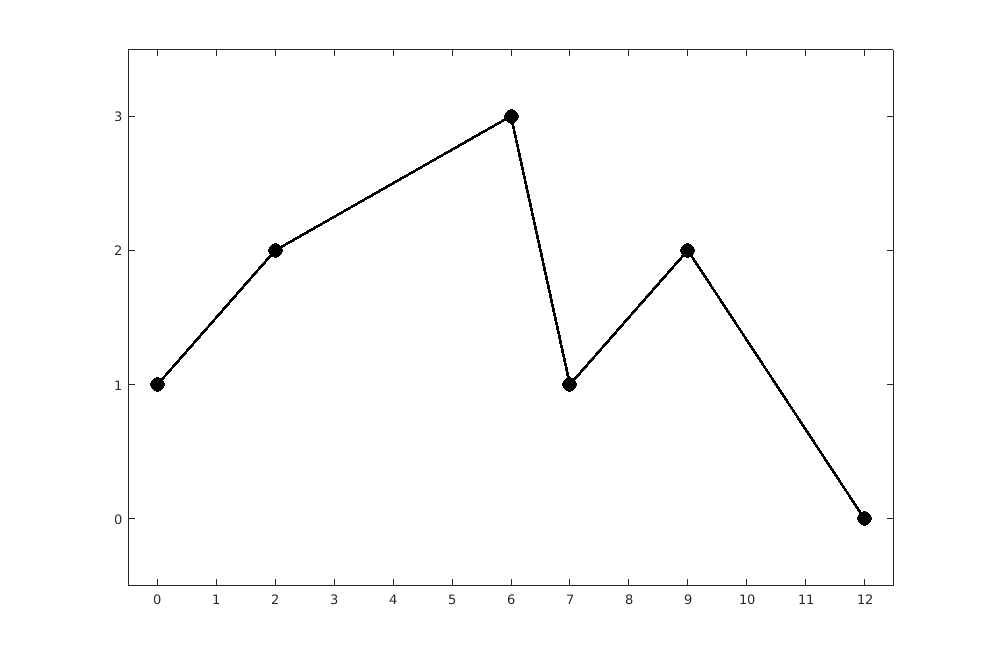

# Teste de programas


## ex01
Considere a função:
```python
def nand(a, b):
    if type(a) != bool or type(b) != bool: return False
    return not (a and b)
```
construa um conjunto abrangente de testes em `unittest` para a função acima.

## ex02
Considere a função:
```python
def binary(x):
    if type(x) != int or x > 1: return 0
    if x < 0: return 1
    return 1 - x
```
construa um conjunto abrangente de testes em `unittest` para a função acima.

## ex03
Considere a função:
```python
def divisores(n):
    if type(n) != int: return -1
    if n < 0: n = -n
    d, i = 0, 2
    while i <= n // 2 :
        if n % i == 0 :
            d += 1
        i += 1
    return d
```
construa um conjunto abrangente de testes em `unittest` para a função acima.

## ex04
Considere a função:
```python
def gcd(a, b):
    if a <= 0 or b <= 0 :
        return 0
    m,d,i = a,1,2
    if a > b :
        m = b
    while i <= m :
        if a % i == 0 and b % i == 0 :
            d = i
        i += 1
    return d
```
construa um conjunto abrangente de testes em `unittest` para a função acima.

## ex05
Considere a função:
```python
def noroots(a, b, c):
    return b**2 < 4*a*c
```
construa um conjunto abrangente de testes em `unittest` para a função acima.

## ex06
Considere a função:
```python
def polzeros(a, b, c):
    if not isinstance(a, (int, float)) \
            or not isinstance(b, (int, float)) \
            or not isinstance(c, (int, float)):
        raise ValueError('Fatores não reais')
    z = b**2 - 4 * a * c
    if z > 0: return 2
    if z == 0: return 1
    return 0
```
construa um conjunto abrangente de testes em `unittest` para a função acima.

## ex07
Considere o programa com acesso à função `polzeros` da pergunta anterior:
```python
from ex06 import polzeros
print('Cálculo do número de zeros reais de um polinómio de grau 2.')
a = eval(input('termo ao quadrado (a) ? '))
b = eval(input('termo linear (b) ? '))
c = eval(input('termo independente (c) ? '))
sol = ('nenhum zero.', 'um zero duplo.', 'dois zeros.')
print('O polinómio tem', sol[polzeros(a, b, c)])
```
construa um conjunto abrangente de testes em `unittest` para programa acima.

## ex08
Considere a função:
```python
def printn(n, b) :
    tab = '0123456789abcdefghijklmnopqrstuvwxyz'
    if b < 0 or b > 35:
        raise ValueError('Invalid base (2 to 35)')
    out = ''
    a = int(n // b)
    if a != 0:
        out += printn(a, b)
    out += tab[n % b]
    return out
```
construa um conjunto abrangente de testes em `unittest` para a função acima.

## ex09
Considere a função:
```python
def soma(x):
    if not isinstance(x, (list, tuple)):
        raise ValueError('Argumento deve ser lista ou tuplo')
    sum = 0
    for i in x:
        if not isinstance(i, (int, float)):
            raise ValueError('Elemento deve ser inteiro ou real')
        sum += i
    return sum
```
construa um conjunto abrangente de testes em `unittest` para a função acima.

## ex10
Considere a função:
```python
def horner(pol, x, res=0) :
    if not pol:
        return res
    return horner(pol[1:], x, res * x + pol[0])
```

## ex11
Considere o programa com acesso à função `horner` da pergunta anterior:
```python
from ex10 import horner
print('Polinómio: 4x^2 + 3x + 2')
x = float(input('x = '))
print(horner([4, 3, 2], x))
```
construa um conjunto abrangente de testes em `unittest` para programa acima.

## ex12
Construa um conjunto abrangente de testes em `unittest` para a rotina `sqrt`
do módulo `math`. Para efeitos da construção dos testes, podemos assumir que a rotina
não tem erros de realização.
```
>>> from math import sqrt
>>> sqrt(20)
4.47213595499958
```
construa um conjunto abrangente de testes em `unittest` para programa acima,
considerando apenas valores inteiros no argumento.

## ex13
Considere a rotina `mode` do pacote `statistics` que calcula a moda de um tuplo de
valores inteiro. Recorda-se que a moda é o valor mais frequente. Em caso de empate
deve considerar o que acontece primeiro. Por exemplo,
```
>>> import statistics
>>> x = (1, 2, 3, 4, 2, 5, 3, 2)
>>> statistics.mode(x)
2
```
construa um conjunto abrangente de testes em `unittest` para programa acima,
considerando apenas valores inteiros no argumento.

## ex14
Considere a rotina `variance` do pacote `statistics` que calcula o estimador não enviezado
da variância de um tuplo de valores reais em vírgula flutuante em precisão dupla (float):
^2)
onde 

Por exemplo,
```python
>>> import statistics
>>> x = (1.2, 2.1, 3.5, 4.8, 2.6, 5.1, 3.3, 2.9)
>>> statistics.variance(x)
1.7041071428571426
```
construa um conjunto abrangente de testes em `unittest` para programa acima,
considerando valores reais no argumento.

## ex15
Construa um conjunto abrangente de testes em `unittest` para
a rotina `piecewise` que devolve o valor de uma função real definida
secionalmente linear. 
A rotina recebe um iterável (por exemplo, uma lista) com as coordenadas de valores
reais (um par **x** e **y**) e um valor de absissa (que pode coincidir com alguma
das absissas das coordenadas dadas.
Se o valor da absissa indicado no argumento se encontrar fora do domínio da função,
a rotina deve devolver **nan** (`math.nan`).
O valor da função num ponto intermédio é dado por:
\frac{y_1-y_0}{x_1-x_0},x\in[x_i,x_{i%2B1}])

Por exemplo, a função

```
>>> piecewise([(0,1),(2,2),(6,3),(7,1),(9,2),(12,0)], 3.5)
2.375
>>> piecewise([(0,1),(2,2),6,3),(7,1),(9,2),(12,0)], 13.5)
nan
```

Depois de construir todos os testes, estes devem produzir **fail**.
Só depois de concluir todos os testes deve iniciar a codificação da
função `piecewise`.
No fim deve passar a todos os testes e garantir uma cobertura de pelo menos 100%.
Note que passar em todas as linhas, ou seja uma cobertura de 100%,
não garante o teste de todas as possibilidades da instrução,
por exemplo em expressões com operadores *short-cut*.

## ex16
Suponha que quer representar o tempo, dividindo-o em horas e minutos. Na classe `Tempo` o número de
minutos está compreendido entre `0` e `59`, e o número de horas apenas está limitado inferiormente a
zero. Por exemplo, `546:37` é um tempo válido. Considere as operações básicas da classe `Tempo`:

- Construtor `Tempo(h,m)`, em que `h ≥ 0` e `0 ≤ m ≤ 59` tem como valor o tempo `h : m`.
- Seletores:
	- `horas(t)` tem como valor as horas do tempo `t`.
	- `minutos(t)` tem como valor os minutos do tempo `t`.
	- `t.num_minutos()` tem como valor o número de minutos entre o tempo `0 : 0` e o tempo `t`.
- Reconhecedores:
	- `eh_tempo(arg)` tem o valor verdadeiro apenas se `arg` é um tempo.
- Teste:
	- `t1.igual(t2)` tem o valor verdadeiro apenas se os tempos `t1` e `t2` são iguais.
	- `t1.posterior(t2)` tem o valor verdadeiro apenas se o tempo `t1` é posterior a `t2`.

Construa um conjunto abrangente de testes em `unittest` para a classe acima.
Depois de construir todos os testes, estes devem produzir **fail**.
Realize a classe por forma a garantir uma cobertura de pelo menos 100%.

## ex17
Construa um conjunto abrangente de testes em `unittest` para
a classe `SkiRental` cujo construtor recebe o preço diario de aluguer
de um par de skis normais e de um snowboard, bem como o *stock* de cada tipo.
Na loja é permitido fazer reservas anticipadas, mas só para o mesmo dia.
Numa reserva é dado um nome único, o número de skis e snowboards que se pretendem
reservar e é devolvido o custo dessa reserva.
Defina os seguintes métodos da classe `SkiRental`:

- `preco_ski`, que retorna o preço de uns skis;
- `preco_snowboard`, que retorna o preço de um snowboard;
- `stock` que retorna o *stock* atual na loja de aluguer, como um tuplo;
- `reserva` que retorna o custo de uma reserva efetuada na loja de aluguer;
- `aluga` que atualiza o stock e devolve o custo, onde apenas a quantidade reservada é garantida;
- `cancela` que anula uma reserva anterior;
- `devolve` que atualiza o *stock* após a devolução do equipamento e devolve a quantidade em falta;
- `fecho` que devolve o *stock* em falta e o saldo do dia, como um tuplo; após o fecho o *stock* atual é o *stock* máximo do dia seguinte.

Defina também a representação do `SkiRental` como nos exemplos abaixo.
Mostra-se a seguir um exemplo de interação:
```
>>> s = SkiRental(20, 35, 200, 100)
>>> s
Ski: 20; Snowboard: 35
>>> s.preco_ski()
20
>>> s.preco_snowboard()
35
>>> s.stock()
(200, 100)
>>> s.reserva('andré', 2,1)
75
>>> s.reserva('luís', 3,1)
95
>>> s.aluga('luís', 4,2)
150
>>> s.cancela('andré')
>>> s.devolve('luís', 2,2)
(2, 0)
>>> s.fecho()
(2, 0, 150)
```

Depois de construir todos os testes, estes devem produzir **fail**.
Realize incrementalemente a classe `SkiRental`, executando regularmente
a sequência de testes, por forma a ir gradualmente passando a um maior
número de testes.
No final deve garantir uma cobertura de pelo menos 100%.

## ex18
Considere as classes `Mensagem` e `MensagemPT` que oferecem um conjunto
de mensagens originais em inglês e as repetivas traduções em português:
```python
class Msg:
        @staticmethod
        def name(): return "name"
        @staticmethod
        def project(): return "project"
        @staticmethod
        def author(): return "author"
        @staticmethod
        def version(): return "version"

class MsgPT(Msg):
        @staticmethod
        def name(): return "nome"
        @staticmethod
        def project(): return "projeto"
        @staticmethod
        def author(): return "autor"
        @staticmethod
        def version(): return "versão"
```

Depois de construir todos os testes, estes devem produzir **fail**.
No final deve garantir uma cobertura de pelo menos 100%.

## ex19
Considere as classes `Metropolitano`, `Utente` e `UtentePasse`, cuja funcionalidade se descreve de seguida:

Classe `Metropolitano`: Esta classe representa um meio de transporte. Este meio de transporte contabiliza o número de viagens efectuadas pelos seus utentes. Os utentes podem iniciar as viagens numa das dez (10) estações disponíveis, numeradas de 0 a 9. O metropolitano contabiliza também o número de viagens iniciado em cada uma das suas estações. Quando um objecto desta classe é criado todos estes valores são inicializados a zero.

Esta classe deve ainda implementar os seguintes métodos:
`obtem_numero_viagens` que devolve o número total de viagens servidas;
`contabiliza_viagem`, que recebe um valor inteiro, entre 0 e 9, que identifica a estação onde se inicia a viagem e incrementa o contador que contabiliza o número total de viagens efectuadas, bem como o contador associado à estação indicada;
Deve haver também um outro método `obtem_numero_viagens` que recebe um valor inteiro, entre 0 e 9, identificando uma estação e que devolve o número de viagens que se iniciaram na estação indicada.


Classe `Utente`: Esta classe representa um utente do sistema de metropolitano. Um utente tem um `nome`, que corresponde a uma cadeia de caracteres arbitrária e está associado a uma instância da classe `Metropolitano`. Garanta a existência de um construtor desta classe que permita especificar o nome do utente. Um utente pode viajar e pedir informações. Assim, esta classe deverá conter os métodos:
`pede_informacoes` deverá imprimir para o ecrã a seguinte cadeia de caracteres: `"Como vou para o IST?"`;
`viaja` recebe um valor inteiro, entre `0` e `9`, que identifica uma estação de metropolitano e deverá invocar o método relevante sobre a instância da classe `Metropolitano` a que está associado, mas antes disso deverá fazer a validação do título de transporte;
`_valida_titulo` procede à validação do título e não deverá ter acesso público. Ao invocar este método, deverá aparecer no ecrã a seguinte cadeia de caracteres: `"Título Válido"`;
`obtem_nome` devolve o nome do utente.


Classe `UtentePasse`: Esta classe representa um utente com passe. Um cliente com passe é, para todos os efeitos, um utente, no entanto, existem duas diferenças importantes. Em primeiro lugar, quando um utente com passe valida o seu título, deverá aparecer no ecrã o mesmo que aparece ao utente genérico acrescido de uma nova linha, com a seguinte cadeia de caracteres: `"Válido até ao final do mês corrente"`. Em segundo lugar, admitimos que o utente com passe contabiliza o número de viagens efectuadas com o seu título, para efeitos estatísticos. Assim, esta classe deverá incluir na sua interface o método `obtem_numero_viagens` que devolve o número de viagens efectuadas pelo utente com passe.

Depois de construir todos os testes para cada uma das três classes, estes devem produzir **fail**.
Realize incrementalemente cada uma das classes, executando regularmente
a sequência de testes, por forma a ir gradualmente passando a um maior
número de testes.
No final deve garantir uma cobertura de pelo menos 100%.

## ex20
Pretende-se testar o cálculo das raíses reais de um polinómio do segundo grau

dadas pela rotina de argumentos reais
```python
def roots(a, b, c):
	if b**2 < 4 * a * c:
		return ()
	x = sqrt(b**2 - 4 * a * c)
	return (-b+x)/(2*a), (-b-x)/(2*a)
```
Sabendo que não pode usar a rotina de cálculo da raiz quadrada `sqrt` disponível em `math`,
nem qualquer outra forma de cálculo da mesma, construa testes abrangentes que permitam
verifica a correção da rotina acima.
