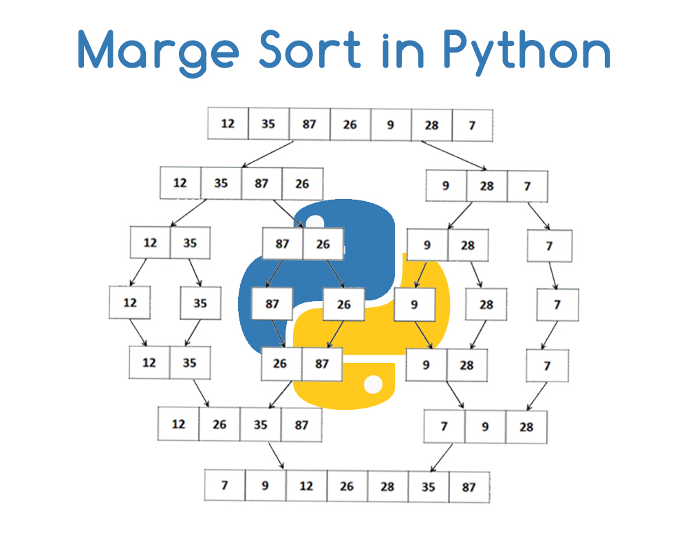

# Complexidade: Big-O, pesquisa e ordenação.



Considere que os algoritmos de ordenação ordenam sempre de forma não decrescente.

## ex01 (Análise Assimptótica)

Considere a seguinte função de procura de um elemento num vector ordenado.
A função recebe um vector **a**, o número de elementos *n* e o valor *elem*
que se pretende encontrar no vector.

```python
def search(vec, elem):
        left , right = 0, len(vec)-1

        while left <= right:
                med = (left + right) // 2
                if vec[med] == elem:
                        return med
                elif vec[med] < elem:
                        left = med+1
                else:
                        right = med-1
        return -1
```

Indique a complexidade assimptótica da função search numa análise de pior caso
e numa análise de melhor caso.

## ex02 (Análise Assimptótica)

Indique a complexidade assimptótica da função abaixo numa análise de pior caso.
Indique ainda se o limite assimptótico é apertado ou se é apenas um limite superior.

```
def funcao(vec):
        sum = 0
        n = len(vec)
        for i in range(n//2):
                sum += vec[i] + vec[n-i-1]
        return sum
```


## ex03 (Análise Assimptótica)

Considere a função abaixo que recebe dois vectores (**a** e **b**) onde
*n* e *m* denotam o número de elementos dos vectores **a** e **b**, respectivamente.

```python
def funcao (a, b):
        n, m = len(a), len(b)
        i, count = n-1, 0

        while i > 0:
                for j in range(m):
                        if a[i] == b[j]:
                                count += 1
                i = i // 2
        return count
```

Indique a complexidade assimptótica da função em função de *n* e *m* numa análise de pior caso.


## ex04 (Análise Assimptótica)

Considere a função abaixo que recebe dois inteiros *n* e *m*.

```python
def funcao (n, m):
        i = count = 0

        while i < n * n:
                if i % m == 0:
                        count += 1
                i += 1
        return count
```

Indique a complexidade assimptótica da função numa análise de pior caso.


## ex05 (Análise Assimptótica)

Considere a função abaixo que recebe dois inteiros *n* e *m*.

```
def funcao (n, m):
	i = count = 0

	if n % m == 0:
		return 0

	while i < n * n:
		if i % m == 0:
			count += 1
		i += 2
	return count
```

Indique a complexidade assimptótica da função numa análise de pior caso e numa análise de melhor caso.
É possível estabelecer uma complexidade assimptótica apertada para esta função? Justifique.


## ex06 (SelectionSort)

Considere a aplicação do algoritmo *selectionsort* ao vector **a**:

**a** = { 20, 11, 16, 8, 21, 12, 10, 14, 17, 6 }

Supondo que em cada iteração o algoritmo identifica o menor elemento e
o coloca na posição mais à esquerda, qual o conteúdo do vector **a**
após as três primeiras iterações?

## ex07 (SelectionSort)

Resolva o exercício anterior, mas considerando uma variação do
algoritmo SelectionSort. Suponha que em cada iteração, o algoritmo
identifica o maior elemento e o coloca na posição mais à direita.
Qual o conteúdo do vector **a** após as três primeiras iterações?

## ex08 (InsertionSort)

Considere a aplicação do algoritmo *insertionsort* ao vector **a**:

**a** = { 20, 11, 16, 8, 21, 12, 10, 14, 17, 6 }

Supondo que o algoritmo vai inserindo os elementos à esquerda,
qual o conteúdo do vector **a** após as três primeiras iterações?

## ex09 (BubbleSort)

Considere a aplicação do algoritmo *bubblesort* ao vector **a**:

**a** = { 20, 11, 16, 8, 21, 12, 10, 14, 17, 6 }

Supondo que em cada iteração o algoritmo percorre o vector da esquerda para a direita, qual o
conteúdo do vector **a** após as duas primeiras iterações?

## ex10 (BubbleSort - Melhor Caso)

A complexidade assimptótica de pior caso do algoritmo *bubblesort*,
é *O(n²)*. E no melhor caso? Ilustre com um exemplo.

## ex11 (QuickSort - partition)

Considere a implementação clássica da função `int partition (Item v[], int l, int r)` usada no algoritmo quicksort tal como apresentada nas aulas teóricas. Esta função recebe o vector `v` e as posições `left` e `right` que definem, respectivamente, os índices limite esquerdo e direito do vector a considerar na função. Suponha que o procedimento partition é invocado com os seguintes argumentos: `v = <13, 6, 5, 14, 12, 4, 16, 18, 7, 9, 10>`, `left = 0`, `right = 10`.  Considerando a posição `a[r]` como pivot, indique qual o conteúdo do vector `v` após a execução da função `partition`.

## Ex 12

Considere o exercício anterior, mas onde os argumentos da função `partition` são os seguintes: `v =<20, 11, 16, 9, 12, 14, 17, 19, 13, 15>`, `left = 0` , `right = 9`. Qual o conteúdo do vector `v` após a execução do procedimento `partition`?

## Ex 13

Diga quais dos seguintes vectores corresponde a um amontoado (heap)?

- `<50, 25, 30, 27, 24, 21, 28>`
- `<50, 30, 25, 27, 24, 28, 21>`
- `<60, 50, 9, 40, 41, 10, 8>`
- `<40, 15, 18, 13, 11, 14, 16>`
- `<60, 30, 80, 10, 35, 70, 40>`

## Ex 14

A primeira operação do algoritmo heapsort é transformar o vector num amontoado. Considere que o vector de entrada do algoritmo é `<20, 11, 16, 9, 12, 14, 17, 19, 13, 15>`.

- Indique o conteúdo do vector após o passo de transformação num amontoado.
- Indique o conteúdo do vector após os dois maiores elementos terem sido ordenados (colocados na sua posição final), durante a operação de ordenação (heapsort).

## Ex 15

Qual o conteúdo do seguinte vector `<25, 19, 23, 15, 18, 16, 21, 12>` depois de os dois primeiros elementos (i.e. os dois maiores) terem sido ordenados, utilizando o algoritmo de ordenação heapsort?
