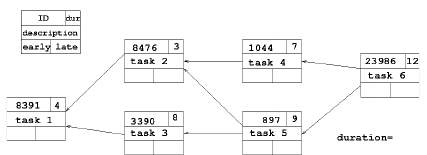
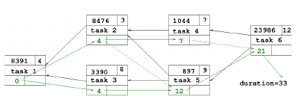
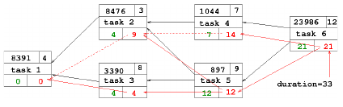

# Enunciado do Projecto 2 - Fprog 2022/23 LEFT

## Data de entrega: 16 de janeiro de 2023, às 16h59

## LOG alterações

- 2jan22 - Publicação do enunciado.

## 1. Introdução

O segundo projeto resulta de uma evolução do primeiro projeto.
Pretende-se encapsular as funções já desenvolvidas num ambiente
orientado para objetos e desenvolver novas funcionalidades.

O planeamento de projectos é uma componente fundamental da gestão
de projectos, sejam projectos informáticos, de engenharia civil ou outros.
O planeamento de projectos consiste no escalonamento temporal das
diversas tarefas por forma a evidenciar o seu paralelismo ou sequencialidade.
Dado um conjunto de tarefas, as suas durações estimadas e as suas
dependências, é possível estimar quando a tarefa poderá começar a ser executada.
Desta forma, é possível reservar atempadamente os recursos necessários
à sua realização, sejam recursos humanos ou materiais.
Uma tarefa apenas pode ser iniciada assim que todas as suas dependências
estejam concluídas. O instante de tempo em que uma tarefa pode começar
a ser executada designa-se por *early start*.
Se todas as tarefas se iniciarem assim que possível a duração do projecto
será mínima.
Mas para que tal seja possível, pode ser necessário reservar um grande
número de recursos em certos períodos de tempo.
Por exemplo, se o escalonamento por *early start* obrigar, em certo
momento do projecto, a realizar três tarefas em simultâneo, pode não
haver recursos suficientes disponíveis.
A alternativa consiste em atrasar algumas tarefas até que haja recursos
suficientes.
Contudo, se algumas tarefas forem atrasadas, a duração total do projecto
poderá aumentar.
Podem no entanto existir tarefas que, por exemplo por serem curtas,
possam ser atrasadas sem afectar a duração total do projecto.
O momento mais tarde em que uma tarefa se pode iniciar sem atrasar
a duração total do projecto é designado por *late start*.
Se uma tarefa tiver um *early start* igual ao *late start* diz-se crítica,
pois qualquer atraso no seu início tem consequências imediatas
na duração total do projecto.
Uma sequência contendo todas as tarefas críticas de um projecto
designa-se por caminho crítico (critical path).

## 2 Orientação por objetos

Pretende-se transformar as funções do projeto anterior em métodos
de classes.
Para tal, as operações correspondentes à atividade (**2.1** no projeto
anterior) devem ser convertidas em métodos da classe `Atividade`.
Da mesma forma, as operações correspondentes ao utilizador (**2.2**) e
à tarefa (**2.3**) devem ser convertidas em métodos das
classes `Utilizador` e `Tarefa`, respetivamente.
Cada classe deve ser realizada num ficheiro individual com o mesmo nome
da classe (e extensão **.py**).
Funções individuais devem ser colocadas noutros ficheiros.

Os construtores (`cria_`) devem ser transformados em
construtores da classe e os transformadores em carateres (`_str`) no
respetivo operador da linguagem.
O formato para a impressão das durações é unicamente `%g`.
Os reconhecedores já não são necessários.
As mensagens das exceções devem permanecer inalteradas.
Como os métodos já pertencem a uma classe, os respetivos nomes
perdem os prefixos `atividade_` `utilizador_` e `tarefa_` e os
corpos dos métodos devem ser adaptados em conformidade.
Não podem existir variáveis globais (variáveis fora de classes ou funções).

### 2.1 Tarefas dependentes
Para o cálculo do caminho crítico as tarefas necessitam de saber quais as
tarefas de que dependem, bem como os tempos de *early start* e *late start*.
Para tal deve ser definida a classe `TarefaDependente`, que herda da classe
`Tarefa`.
Quando é construída uma instância de `TarefaDependente` esta não tem
tarefas dependentes e os tempos de *early start* e *late start* são
inciados a `0` e `inf`, respetivamente.
A classe `TarefaDependente` deve definir métodos para os operadores `+=` e `-=`
que permitem adicionar e remover uma tarefa dependente à tarefa.
Da mesma forma, deve definir um operador que permita determinar o número
de tarefas diretamente dependentes de uma tarefa: `len(tarefa)`.
Para iterar sobre as tarefas dependentes, a classe `TarefaDependente`
deve devolver um iterador (`iter(tarefa)`) que permita fazer operações
do tipo: `for depend in tarefa: print(depend.representacao())`.
No entanto, deve ser garantido que uma instância da classe base (`Tarefa`)
devolva um iterador vazio, pois as suas instâncias não suportam tarefas
dependentes.
Defina ainda os métodos:

`inicio() -> float` que devolve o valor do *early start*,

`folga() -> float` que devolve a diferença entre o *late start* e o *early start*,

`critica() -> bool` que devolve `True` se a folga for nula e `False` caso contrário,

bem como o método `limpa()` que coloca ambos os valores nas condições iniciais.
Os valores do *early start* e *late start* são apenas alterados pelo método
`caminho_critico` (ver **2.4.1**).

### 2.2 Sistema
As funcionalidades globais, que vão agregar todas as atividades, utilizadores e tarefas do sistema, devem ser reunidas na classe `Sistema`.
Uma instância da classe `Sistema` deve ser passada como primeiro argumento dos
construtores das outras classes, a que se seguem os argumentos já anteriormente
definidos, por forma a todas as instâncias poderem aceder-lhe.
Podem ser criadas várias classes `Sistema` totalemente independentes, devendo os
nomes das tarefas ser únicos apenas dentro de cada sistema.

A classe `Sistema` deve definir métodos que permitam registar as instâncias
de `Atividade`, `Utilizador` e `Tarefa`, respetivamente designados por
`atividade(act)`, `utilizador(user)` e `tarefa(tsk)`.
A classe deve igualmente disponibilizar métodos que devolvam iteradores
para os três tipos de instâncias, designados por `atividades()`,
`utilizadores()` e `tarefas()`.

A classe `Sistema` deve também suportar a pesquisa eficiente de descrições
de tarefas registadas sob a forma do operador `in`, por exemplo
`if desc in sistema: print('Existe uma tarefa com essa descrição')`

Finalmente, para a determinação do caminho crítico (ver 2.4),
devem ser definidos os métodos:

`fonte() -> tuple[Tarefa]` que devolve um tuplo com todas as tarefas que não têm dependentes, ordenado por descrição da tarefa,

`sorvedoro() -> tuple[Tarefa]` que devolve um tuplo com todas as tarefas de que nenhuma tarefa depende, ordenado por descrição da tarefa.

`caminho_critico() -> float` que devolve um tuplo com as tarefas de um caminho crítico e atualiza os tempos de *early start* e *late start* de todas as tarefas no sistema que suportam esse cálculo.

### 2.3 Grupos de utilizadores

As tarefas suportam um `Utilizador` como colaborador nas atividades da tarefa.
Para permitir que diversos colaboradores possam ajudar no desenvolvimento da
tarefa deve ser criada a classe `Grupo`, que é um utilizador, com uma
identificação, uma descrição e um tempo gasto, tal como um utilizador normal.

No entanto um utilizador do tipo `Grupo` permite adicionar (com o operador `+=`) e remover (operador `-=`) utilizadores, ou outros grupos de utilizadores,
ao grupo.
Deve ser possível saber quantos elementos compoem o grupo com recurso à função `len`.

As únicas diferenças residem no facto de o tempo gasto ser distribuído equitativamente por todos os utilizadores do grupo e a sua representação em cadeia de carateres (`str`) inclui no fim da *string* `:len`, onde `len` representa o número de utilizadores diretamente colocados no grupo.


### 2.4 Caminho crítico
A determinação do caminho crítico deve começar por analisar todas as
tarefas finais, ou sorvedoros, *i.e.*, aquelas de que nenhuma outra
tarefa depende.
Para cada tarefa final deve determinar os *early start* percorrendo
todas as suas dependências, e recursivamente as dependências delas,
calculando, do início para o fim, o tempo que resulta da sua dependência
que termina mais tarde (maior *early finish*).
O *early start* de uma tarefa origem (ou fonte) é 0.
A duração do projecto é o maior valor entre os *early finish* das
tarefas finais, onde o *early finish* é a soma da duração da tarefa
com o seu *early start*.

Para a determinação dos *late start*, deve subtrair da duração do projecto
a duração da respetiva tarefa final e proceder como anteriormente com as
dependências subtraindo sucessivamente as durações dessas tarefas.	  
O caminho crítico corresponde às tarefas onde o *early start* é igual
ao *late start*.	  
Exemplo: Considere as 6 tarefas abaixo, onde uma seta de `a` para `b`
significa que a tarefa `a` é dependente da tarefa `b`.	  



O cálculo do *early start* começa nas tarefas origem (sem precedentes,
`task 1`) e caminha na direcção das tarefas finais (das quais ninguém
depende, `task 6`). O *early start* de uma tarefa é o maior valor
(`duração + early-start`) entre todas as dependências da tarefa.
Notar que as setas a preto dirigem-se das tarefas finais para as origens.



O cálculo do *late start* começa nas tarefas finais e caminha para as
tarefas origem subtraindo a sua duração ao menor tempo dos seus sucessores.



#### 2.4.1 Tarefas do caminho crítico `caminho_critico: -> tuple[Tarefa]`

Esta função devolve um tuplo constituído por todas as tarefas sem folga
de um caminho crítico e, implicitamente, atualiza os tempos
e folgas de todas as tarefas.
As tarefas do tuplo devem estar ordenadas pela ordem em que devem ser executadas.

Por exemplo:
```
>>> s = Sistema()
>>> t1 = TarefaDependente(s, 'task 1', 4)
>>> t2 = TarefaDependente(s, 'task 2', 3)
>>> t3 = TarefaDependente(s, 'task 3', 8)
>>> t4 = TarefaDependente(s, 'task 4', 7)
>>> t5 = TarefaDependente(s, 'task 5', 9)
>>> t6 = TarefaDependente(s, 'task 6', 12)
>>> t2 += t1
>>> t3 += t1
>>> t4 += t2
>>> t5 += t2
>>> t5 += t3
>>> t6 += t5
>>> t6 += t4
>>> [ tsk.representacao()[0] for tsk in sys.caminho_critico() ]
['task 1', 'task 3', 'task 5', 'task 6']
```

#### 2.5 Duração do caminho crítico `duracao: tuple[Tarefa] -> float`
Esta função que não pertence a qualquer classe calcula a duração do caminho crítico
passado como argumento e, implicitamente, os tempos e folgas das tarefas.

O exemplo acima pode ser complementado com:
```
>>> duracao(s.caminho_critico())
33.0
```

### 2.6 Teste à operação de adicionar tarefa dependente
Deve incluir na sua entrega um ficheiro de teste em *unittest*
(**test.py**) que deverá incluir um conjunto abrangente de testes
à funcionalidade de adicionar uma tarefa dependente a uma tarefa
(operador `+=`), tal como indicado em **2.1**.

## 3. Teste do projeto

Para executar os testes deve bastar incluir o ficheiro `Sistema.py`
para ter acesso a todas
as entidades envolvidas.

Para testar o seu programa poderá executar os testes públicos
disponibilizados no repositório git *fp22info* da disciplina.

Além dos testes públicos existe um conjunto de testes privados.
Esta avaliação, embora automática, só é realizada após
a data limite de entrega do projeto.

## 4. Entrega do Projeto

- A entrega do projeto é efetuada até à data limite e exclusivamente através
do repositório atribuído a cada aluno (`fp22ist1xxxxxx`):
`https://git.rnl.tecnico.ulisboa.pt/fp22left/fp22ist1xxxxxx`

- o projeto é avaliado com base na última entrega anterior à data limite,
sendo todos os *commits* após essa data ignorados.
Não se esqueça que só após um *git push* é que o código é submetido ao
servidor.

- A realização de pelo menos um *commit* pressupõe o compromisso de honra
que apenas o aluno com acesso ao repositório realizou o projeto.
Será utilizada uma ferramenta automática de deteção de cópias, a ocorrência
de cópias será comunicada às entidades competentes e a nota do projeto será
0 (zero). Cópias, mesmo que parciais, são consideradas cópias.

## 5. Avaliação do Projeto

Na avaliação do projeto serão consideradas as seguintes componentes:

1. A primeira componente avalia o desempenho da funcionalidade do programa
realizado. Esta componente é avaliada automaticamente entre 0 e 12 valores.
Existem limites de tempo e memória durante a avaliação automática.

2. A segunda componente, entre 0 e 4 valores, avalia a classe de teste e a
correta aplicação dos conceitos orientados por objetos.

3. A terceira componente avalia a qualidade do código entregue, nomeadamente
os seguintes aspectos: comentários, indentação, estruturação, modularidade,
abstração, incluindo os resultados das ferramentas `pylint` e `lizard -L 25`.
Esta componente poderá variar entre -4 valores e +4 valores relativamente à
classificação calculada nos itens anteriores e será atribuída posteriormente.

* Note-se que o facto de um projeto passar com sucesso o conjunto de testes
disponibilizado não implica que esse projeto esteja totalmente correcto,
pois os testes não são exaustivos. É da responsabilidade do aluno garantir
que o código produzido está correto no contexto do enunciado.

* Em caso algum será disponibilizado qualquer tipo de informação sobre os
casos de teste utilizados pelo sistema de avaliação automática. A totalidade
dos ficheiros de teste usados na avaliação do projeto serão disponibilizados
na página da disciplina após a data de entrega.

Bom trabalho.
